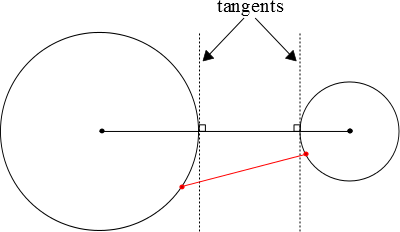

````
alias: Hint
weight: 2
````

<div class="chalk">
I know the standard equation of a circle so to begin I could try to rearrange the equation to look like that, but I think that the question really wants me to go back to first principles and show directly that these points lie on a circle.  I know that a circle is the set of points lying an equal distance from the centre.  Maybe I can use that?
</div>

* * *

<div class="chalk">
For the second part, I need to show that the circles are entirely outside each other.  Perhaps looking at the ranges of $x$ and $y$ coordinates for each circle might help me?
</div>

* * *

<div class="chalk">
I tried thinking about the shortest distance between two non-overlapping circles, and drew the following diagram.



</div>
