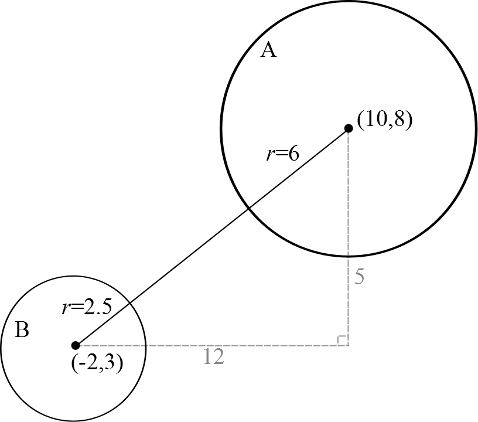

````
alias: Solution
````
Completing the square gives us the equation in the form $$(x+g)^2+(y-f)^2=g^2+f^2+c. \qquad \qquad(\ast)$$

By Pythagoras' Theorem, the distance between the points $(x_1,y_1)$ and $(x_2,y_2)$ is $$\sqrt{(x_2-x_1)^2+(y_2-y_1)^2}.$$

Taking square roots of both sides of $(\ast)$ gives $$\sqrt{(x+g)^2+(y-f)^2}=\sqrt{g^2+f^2+c}$$ and so the distance between points $(x,y)$ and $(-g,f)$ is $\sqrt{g^2+f^2+c}$. Therefore all points which satisfy this equation are the same distance away from $(-g,f)$, which shows they lie on a circle.

The circle has centre $(-g,f)$ and radius $\sqrt{g^2+f^2+c}$.


<:= style(chalk) :>
We have explained why the points satisfying $$(x-a)^2+(y-b)^2=r^2$$ lie on a circle with centre $(a,b)$ and radius $r$. 
In the next part of the question we can use this to
quickly identify the centres and radii of the circles.
<:= style() :>

Call the first circle $A$ and the second circle $B$.

Circle $A$:
Using the form of the first part, $g=-10$,  $f=-8$,  $c=128$.
So $A$ is a circle with centre $(10,8)$ and radius
$\sqrt{(-10)^2+(-8)^2-128}=\sqrt{36}=6$.

Circle $B$:
Divide the equation by $4$ to give $$x^2+y^2+4x-6y-\frac{29}{4}=0$$ which is of
the same form as the first part.
Then $g=2$,  $f=-3$,  $c=-\frac{29}{4}$, so this is a circle with centre
$(-2,3)$ and radius
$\sqrt{2^2+(-3)^2+\frac{29}{4}}=\sqrt{\frac{81}{4}}=\frac{9}{2}$.

Because the $x$-coordinate of the centre of circle $A$ is $10$ and the radius
is $6$, all points on the circle have $x$-coordinates in the range $4\leq
x\leq16$.

Similarly, all points on circle $B$ have $x$-coordinates in the range
$-\frac{13}{2}\leq x\leq\frac{5}{2}$.

But $\frac{5}{2} < 4$, so the two ranges of $x$ do not overlap, therefore
the two circles lie entirely outside each other.


<:= style(chalk) :>

The points with the shortest distance are the points lying on the line joining
the two centres.

<:= style() :>
To find the length of the shortest distance between the two circles consider
the diagram below.



By Pythagoras' Theorem, the length of the hypotenuse of the triangle is
$\sqrt{12^2+5^2}=\sqrt{169}=13$.

Therefore the shortest distance between the two circles is
$13-(6+\frac{9}{2})=\frac{5}{2}$.
