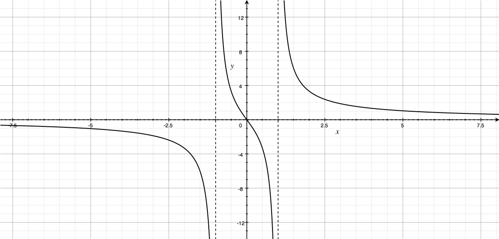
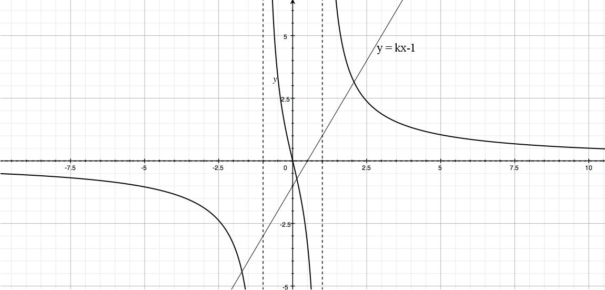
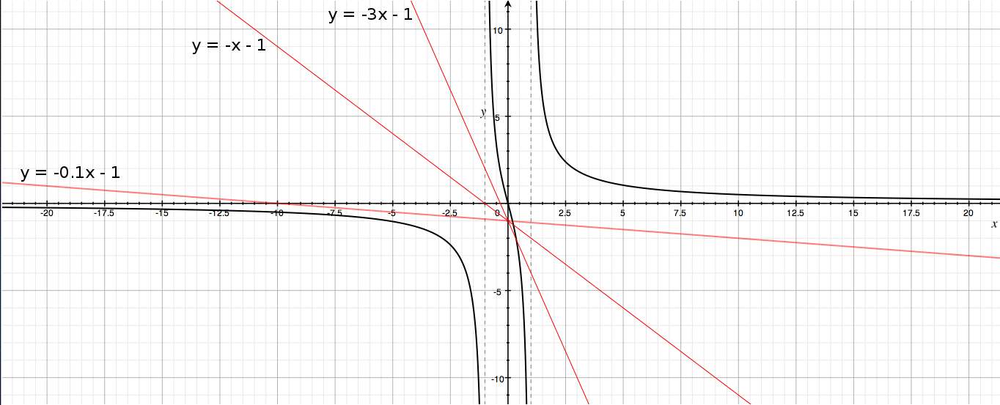

````
alias: Solution
````

Firstly, we want to find the equations of the asymptotes.

We can factorise the denominator of $y = \frac{5x}{x^2 - 1}$ to get  
$$y = \frac{5x}{(x+1)(x-1)}.$$

We can then see from this equation that: 

* as $x \to 1^+$, $y \longrightarrow +\infty$.  

* as $x \to 1^-$, $y \longrightarrow -\infty$.  

* as $x \to -1^+$, $y \longrightarrow +\infty$.  

* as $x \to -1^-$, $y \longrightarrow -\infty$.

Therefore, there are vertical asymptotes with equations  
$$x = 1$$  
and  
$$x = -1.$$  

Similarly, we can see from the equation that:  

* as $x \to +\infty$, $y \to 0^+$.  

* as $x \to -\infty$, $y \to 0^-$.  

So we also have a horizontal asymptote with equation  
$$y = 0.$$  

Now we want to find the points at which the graph crosses the axes.

Setting y = 0 gives  
$$\frac{5x}{x^2 - 1} = 0.$$ 
$$\iff x = 0$$  

So the only point at which the graph crosses the axes is $(0,0)$.  

Therefore the graph will have the following shape.

  


Now to find the number of real roots of the equation  
$$kx - 1 = \frac{5x}{x^2 - 1}$$  
we need to find how many times $y = kx - 1$ and $y = \frac{5x}{x^2 - 1}$ intersect.

We plot the line $y = kx - 1$ on the previous graph for $k > 0$, as shown.  

  

We can see from the graph that $y = kx - 1$ and $y = \frac{5x}{x^2 - 1}$ will always intersect twice, and therefore the equation  
$$kx - 1 = \frac{5x}{x^2 - 1}$$ 
has two real roots.


Finally, we want to show that there is a range of negative values of $k$ for which the equation has only one real root. 

For the equation  
$$kx - 1 = \frac{5x}{x^2 - 1}$$  
to have only one real root, there must be only one point of intersection between $y = \frac{5x}{x^2 - 1}$ and the line $y = kx - 1$.

From the graph, we can see that the line $y = kx - 1$ (for any $k < 0$) must always intersect $y = \frac{5x}{x^2 - 1}$ at least once in the region $-1 < x < 1$. Therefore, for there to be only one real root, the line $y = kx-1$ must intersect $y = \frac{5x}{x^2 - 1}$ at only one point in the region $-1 < x < 1$, and must not intersect it in either of the regions $x > 1$ or $x < -1$. There is a range of negative values of $k$ for which this is true, as demonstrated below.


