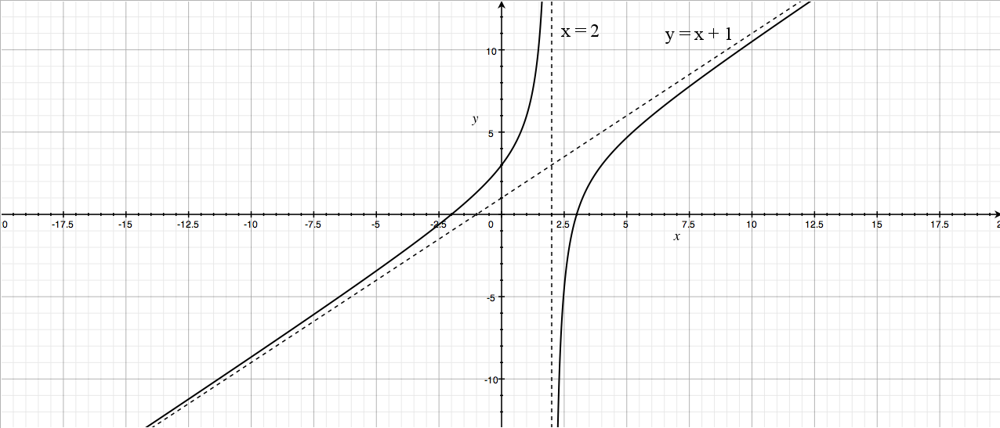

````
alias: Solution
````
First we need to find the asymptotes of the curve  
$$y = x + 1 - \frac{4}{x-2}.$$

We can see from the equation that:  
* as $x \to 2^+$, $y \longrightarrow -\infty$.  
* as $x \to 2^-$, $y \longrightarrow \infty$.

So there is a vertical asymptote with equation  
$$x = 2.$$

We can also rearrange the equation (for $x \neq -1$) to get  
$$\frac{y}{x+1} = 1 -\frac{4}{(x+1)(x-2)},$$  
from which we can see that  
 
$$\frac{y}{x+1} \to 1$$
as $x \to \infty.$

So there is also an asymptote with equation  
$$y = x+1.$$  

Now we need to find the coordinates of the points at which the curve meets the axes.

* Setting $y = 0$ gives  
$$x + 1 - \frac{4}{x-2} = 0.$$
$$\iff (x+1)(x-2) = 4$$
$$\iff x^2 - x - 6 = 0$$
$$\iff (x+2)(x-3) = 0$$
$$\iff x = 3 \textrm { or } x = -2.$$

* Setting $x = 0$ gives $y = 3$.  

So the curve meets the axes at the points $(-2,0)$, $(3,0)$ and $(0,3)$.

The graph therefore has the following shape.


