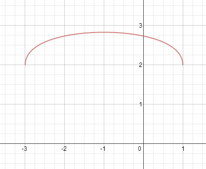
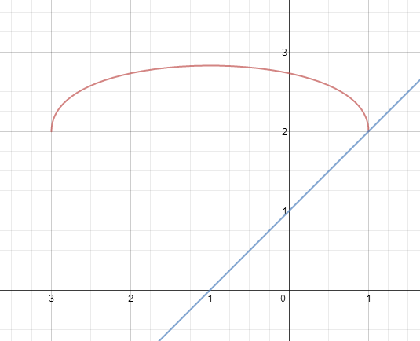
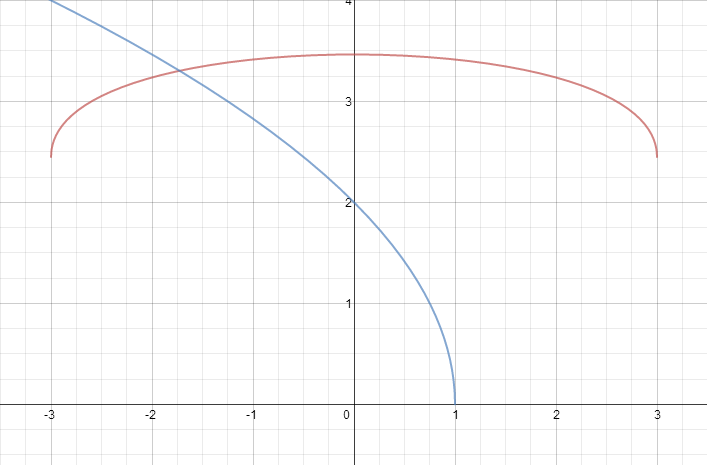

````
alias: Solution
````
NEEDS CHECKING

First, we identify some key properties of the graph $y = \sqrt{1 - x} + \sqrt{3 + x}$ so we can sketch it:

* The right-hand side is defined only for $-3 \leq x \leq 1$, so the endpoints are at $(-3,2)$ and $(1,2)$.

* If we evaluate the function (let's call it $f$) at a few points, we find that $f(-3) = 2$, $f(-2) = 1 + \sqrt{3}$, $f(-1) = 2\sqrt{2}$, $f(0) = 1 + \sqrt{3}$ and $f(1) = 2$. This suggests that the function is symmetric about the line $x = -1$. In fact, we can show this by letting $x = - 1 - a$ and $x = - 1 + a$:

$$x = - 1 - a \Rightarrow y = \sqrt{1 - (- 1 - a)} + \sqrt{3 + (- 1 - a)} = \sqrt{2 + a} + \sqrt{2 - a}$$
$$x = - 1 + a \Rightarrow y = \sqrt{1 - (- 1 + a)} + \sqrt{3 + (- 1 + a)} = \sqrt{2 - a} + \sqrt{2 + a}$$
These are equal, and so the $x$-values which are distance $a$ away from $x = -1$ take the same values of $f(x)$. Hence the graph is symmetric about $x = -1$.

* This implies that the maximum of the graph is at $x = -1$ ????, but we can check this by differentiating to find the stationary points:
$$\frac{dy}{dx} = \frac{-1}{2\sqrt{1 - x}} + \frac{1}{2\sqrt{3 + x}} = 0$$
$$\Rightarrow \sqrt{1 - x} = \sqrt{3 + x}$$
$$\Rightarrow 1 - x = 3 + x$$
$$\Rightarrow x = -1$$
as expected. Clearly this is a maximum because the other points evaluated have values smaller than $2\sqrt{2}$.

* We can also see that the gradient at the endpoints must be infinite, because when the expression for the derivative is evaluated at either of them, one of the fractions will be of the form $\frac{1}{0}$, indicating an asymptote. ????

NOT CHECKED BEYOND HERE.

This gives us enough information to sketch the curve:



Now to solve the equation given, we also plot the graph of $y = x + 1$ and find where they intersect:



So we clearly see that $x = 1$ is the only (real) solution.

***

(ii) Here we use a similar method, and sketch the graphs of the curves $y = \sqrt{3 + x} + \sqrt{3 - x}$ and $y = 2\sqrt{1 - x}$.

The first is essentially the same curve as in (i), but defined on the interval $[-3,3]$, with its maximum at $(0,2\sqrt{3})$ and symmetric in the $y$-axis.

The second curve is similar to the graph of $\sqrt{x}$, with a translation, reflection and enlargement applied to it:

Translation of one unit to the left: $x \rightarrow 1 + x$
Reflection in the $x$-axis: $x \rightarrow - x$
Enlargement by a scale factor of 2: $f(x) \rightarrow 2f(x)$

We can also see that the graph passes through $(1,0)$ and $(0,2)$.

From this, we sketch the two graphs on the same axis:



These curves intersect only once, when $x < 0$.

We use algebra to solve the equation:
$$2\sqrt{1 - x} = \sqrt{3 + x} + \sqrt{3 - x}$$
$$\Rightarrow 4(1 - x) = 3 + x + 2\sqrt{3 + x}\sqrt{3 - x} + 3 - x$$
$$\iff 4 - 4x = 6 + 2\sqrt{(3 + x)(3 - x)}$$
$$\iff 1 + 2x = -\sqrt{9 - x^2}$$
$$\Rightarrow 1 + 4x + 4x^2 = 9 - x^2$$
$$\iff 5x^2 + 4x - 8 = 0$$
$$\Rightarrow x = \frac{-4 \pm \sqrt{16 + 4\times5\times8}}{10}$$
$$\iff x = \frac{-4 \pm \sqrt{16\times11}}{10}$$
$$\iff x = \frac{-4 \pm 4\sqrt{11}}{10}$$
$$\iff x = \frac{-2}{5}(1 \pm \sqrt{11}).$$

Then one of these roots will be positive and one will be negative. However, only the negative root is a valid solution, as evidenced by the sketch. So the solution of this equation is
$$x = \frac{-2}{5}(1 + \sqrt{11}).$$
