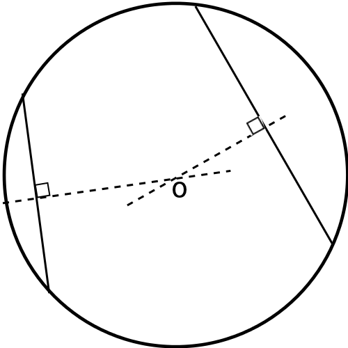
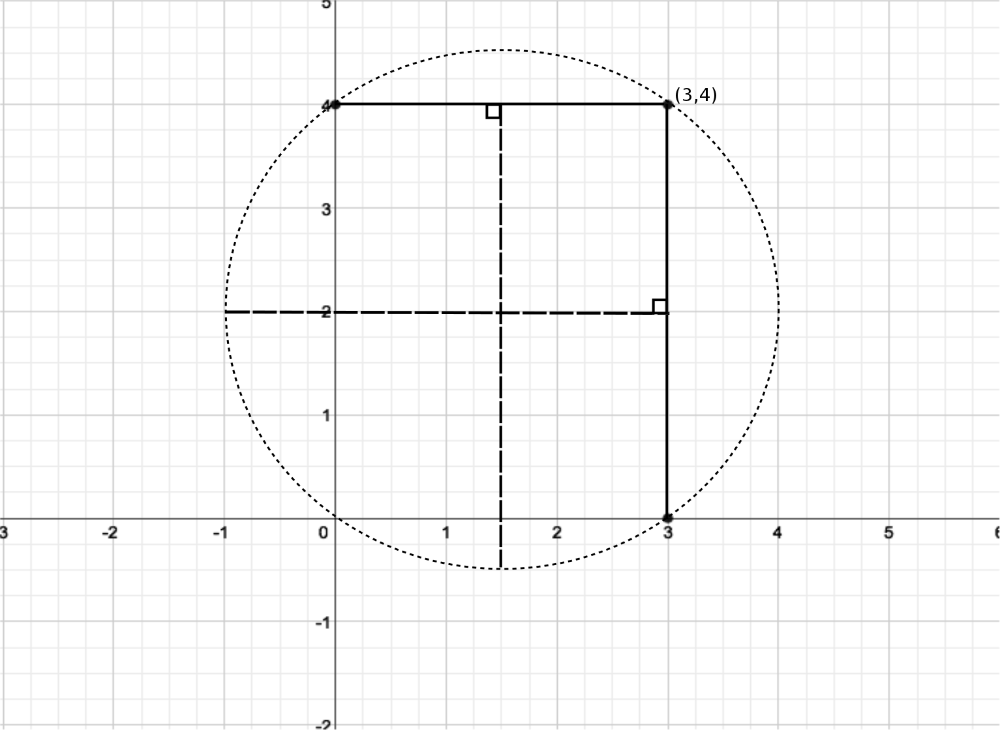

````
alias: Solution
````
##First method

Take the general equation of a circle with centre $(a,b)$ and radius $r$:  
$$(x-a)^2 + (y-b)^2 = r^2.$$

Now consider the first 3 points $(3,0)$, $(0,4)$, $(4,2)$.

For the point $(3,0)$ to lie on this circle, we must have

$$(3-a)^2 + b^2 = r^2.$$

And similarly, for the points $(0,4)$ and $(4,2)$ to lie on this circle, we must have  
$$a^2 + (4-b)^2 = r^2$$  
and  
$$(3-a)^2 + (4-b)^2 = r^2.$$  

Now solve these equations for $a$, $b$ and $r$:

Taking the first equation from the third gives  
$$(4-b)^2 - b^2 = 0$$
$$\Rightarrow b = 2.$$  

Taking the second equation from the third gives  
$$(3-a)^2 - a^2 = 0$$
$$\Rightarrow a = \frac{3}{2}.$$

Now setting $a = \frac{3}{2}$ and $b = 2$ in the first equation gives
$$\left(3-\frac{3}{2}\right)^2 + (2)^2 = r^2$$ 
$$\Rightarrow r^2 = \frac{25}{4}$$
$$\Rightarrow r = \frac{5}{2}$$  

<:= style(chalk) :>
Usually $r^2 = \frac{25}{4} \Rightarrow r = \pm \frac{5}{2}$, but as a radius must always have positive length, we know that we must take the positive square root.
<:= style() :>

So the circle has equation  
$$\left(x-\frac{3}{2}\right)^2 + (y-2)^2 = \frac{25}{4},$$  
so the circle has centre $\left(\frac{3}{2}, 2\right)$ and radius $\frac{5}{2}$.  

Now we can check that the point $(4,2)$ lies on this circle:  
$$\left(4-\frac{3}{2}\right)^2 + (2-2)^2 = \left(\frac{5}{2}\right)^2 + 0^2 = \frac{25}{4}.$$  
So the point $(4,2)$ also lies on the circle.


##Second method

<:= style(chalk) :>
If we have two non-parallel chords in a circle, then their perpendicular bisectors intersect at the centre of the circle, as shown in diagram 1.



<:= style() :>

So if we take the two chords joining the points $(3,0)$ and $(3,4)$, and $(3,4)$ and $(0,4)$ as shown in diagram 2, then we know that the perpendicular bisectors of these chords must intersect at the centre of the circle passing through these three points.  

  

As can be seen from the diagram, the perpendicular bisector of the line segment joining $(3,0)$ and $(3,4)$ is the line  
$$y = 2,$$  
and the perpendicular bisector of the line segment joining $(3,4)$ and $(0,4)$ is the line  
$$x = \frac{3}{2}.$$  

So the centre of the circle passing through the points $(3,0)$, $(0,4)$ and $(3,4)$ is at $\left(\frac{3}{2},2\right)$.

To find the radius, $r$, of the circle, we need to find the distance from the centre, $\left(\frac{3}{2},2\right)$, to any of the three points that we know lie on the circle, say $(3,0)$:  

$$r = \sqrt{\left(\frac{3}{2}-3\right)^2 + (2-0)^2} = \sqrt{\frac{25}{4}} = \frac{5}{2}.$$  

So we have the equation of the circle passing through the points $(3,0)$, $(0,4)$, $(3,4)$ as  
$$\left(x-\frac{3}{2}\right)^2 + (y-2)^2 = \frac{25}{4}.$$  

As this equation agrees with the one we found using method 1, we know that the point $(4,2)$ also lies on this circle.  Alternatively we could simply check it directly.
