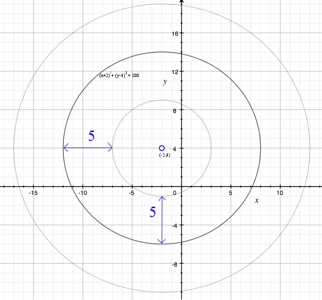

````
alias: Solution
````

<div class="chalk">
The first thing we want to do is to rewrite the equation of the circle in the form $(x-a)^2+(y-b)^2=r^2$ so that we can easily work out its centre and radius.
</div>

We have	  $$x^2+y^2+4x-8y-80=0$$
$$\iff [(x+2)^2 - 4] + [(y-4)^2-16] - 80 =0$$
$$\iff (x+2)^2 + (y-4)^2 = 100.$$

This circle has centre $(-2,4)$ and radius $10$.
This means that a point $Q$ lies inside this circle if and only if the distance between $Q$ and the point $(-2,4)$ is less than $10$.

<div class="chalk">
So, to show that $P$ lies inside this circle, we must show that the distance between $(-9,-3)$ and $(-2,4)$ is less than $10$.
</div>

The distance between $(-9,-3)$ and $(-2,4)$ is $$\sqrt{(-9-(-2))^2+(-3-4)^2} = \sqrt{(-7)^2+(-7)^2} = \sqrt{49+49} = \sqrt{98}.$

Now $\sqrt{98} < \sqrt{100} = 10$. This means that the distance between $P$ and $(-2,4)$ is less than $10$, and so $P$ lies inside the circle.

***

Let $C$ be a circle of radius $5$ passing through $P = (-9,-3)$ and touching the circle $(x+2)^2+(y-4)^2=100$. Let $(a,b)$ denote the centre of $C$.  

As $C$ passes through $(-9,-3)$, we know that $(a,b)$ and $(-9,-3)$ are a distance of $5$ apart. So $(a,b)$ must lie on the circle $(x+9)^2+(y+3)^2=25$.  

<div class="chalk">
If $C$ just touches the circle $(x+2)^2+(y-4)^2=100$, then its centre $(a,b)$ must lie a distance of exactly $5$ away from one point on this circle, and a distance of greater than $5$ units away from all other points on this circle. So $(a,b)$ must lie on one of the two circles in the following diagram:
</div>
  

<div class="chalk pull-right">
The outer circle has equation $(x+2)^2+(y-4)^2=225$, and the inner circle has equation $(x+2)^2+(y-4)^2=25$. 
</div>

If $(a,b)$ lies on the outer circle, then the distance between $(a,b)$ and $(-9,-3)$ must be greater than $5$, as $(-9,-3)$ lies inside the circle. So $(a,b)$ must also lie on the circle $(x+2)^2+(y-4)^2=25$.

Now, we have two equations that $(a,b)$ must satisfy:  
1. $(a+9)^2+(b+3)^2=25$ 
2. $(a+2)^2+(b-4)^2=35$

Equating these two expressions:  
$(a+2)^2+(b-4)^2=(a+9)^2+(b+3)^2$
$\iff a^2+4a+4+b^2-8b+16=a^2+18a+81+b^2+6b+9$
$\iff 70=-14a-14b$
$\iff b=-5-a$

Substituting $b=-5-a$ into equation 1:  

$(a+9)^2+(-2-a)^2=25$
$\iff a^2+18a+81+4+4a+a^2=25$
$\iff a^2+11a+30=0$
$\iff (a+5)(a+6)=0$.

So our two possible values for $a$ are $-5$ and $-6$.

Substituting these values into $b=-5-a$, we get two possible values for $(a,b)$, namely $(-5,0)$ and $(-6,1)$.  

Then, as the circles have radius $5$, the equations for these two circles are $(x+5)^2+y^2=25$ and $(x+6)^2+(y-1^2)=25$.
