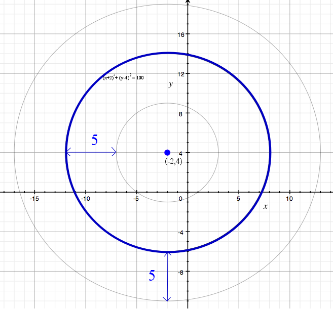

````
alias: Solution
````

<div class="chalk">
The first thing we want to do is re-write the equation of the circle in the form $(x-a)^2+(y-b)^2=r^2$ so that we can easily work out its centre and radius.
</div>  

$x^2+y^2+4x-8y-80=0$

$\Rightarrow [(x+2)^2 - 4] + [(y-4)^2-16] - 80 =0$

$\Rightarrow (x+2)^2 + (y-4)^2 = 100.$

This circle has centre $(-2,4)$ and radius $10$.
This means that a point $Q$ lies inside this circle if and only if the distance between $Q$ and the point $(-2,4)$ is less than $10$.  

So, to show that $P$ lies inside this circle, we must show that the distance between $(-9,-3)$ and $(-2,4)$ is less than $10$.

Let $d$ be the distance between $(-9,-3)$ and $(-2,4). Then

$$d = \sqrt{(-9-(-2))^2+(-3-4)^2}$$

$$= \sqrt{(-7)^2+(-7)^2}$$

$$= \sqrt{49+49}$$

$$= \sqrt{98}$$

Now $\sqrt{98} < \sqrt{100} = 10$. That is, the distance between P and $(-2,4)$ is less than $10$, so $P$ lies inside the circle.

***

Let $C$ be a circle of radius $5$, passing through $P = (-9,-3)$ and touching the circle $(x+2)^2+(y-4)^2=100$. We want to find the centre of $C$. Call the centre $(a,b)$.

Firstly, as $C$ passes through $(-9,-3)$, and as $C$ has radius $5$, we know that $(a,b)$ and $(-9,-3)$ are a distance of $5$ units apart. So $(a,b)$ must lie on the circle $(x+9)^2+(y+3)^2=25$, and therefore  
$$(a+9)^2+(b+3)^2=25.$$

We also know that $C$ just touches the circle $(x+2)^2+(y-4)^2=100$. So the centre of $C$, $(a,b)$, must lie a distance of exactly $5$ units away from one point on this circle, and a distance of greater than $5$ units away from all other points on this circle. This means that $(a,b)$ must lie on one of the faded circles in the diagram below.

  

We know that $(a,b)$ cannot lie on the outer circle because then the distance between $(a,b)$ and $(-9,-3)$ would be greater than $5$ units, because $(-9,-3)$ lies inside the circle. So $(a,b)$ must lie on the inner circle, which has equation $(x+2)^2+(y-4)^2=25$. Therefore  
$$(a+2)^2+(b-4)^2=25.$$ 

This means that we now have two equations which $(a,b)$ must satisfy:  

$$(a+9)^2+(b+3)^2=25$$

and

$$(a+2)^2+(b-4)^2=25.$$

As both of these expressions equal 25, we can equate them to get  
$$(a+2)^2+(b-4)^2=(a+9)^2+(b+3)^2.$$

$$\Rightarrow a^2+4a+4+b^2-8b+16=a^2+18a+81+b^2+6b+9$$

$$\Rightarrow 70=-14a-14b$$

$$\Rightarrow b=-5-a$$  


Substituting $b=-5-a$ into $(a+9)^2+(b+3)^2=25$ gives  
$$(a+9)^2+(-2-a)^2=25.$$

$$\Rightarrow a^2+18a+81+4+4a+a^2=25$$

$$\Rightarrow a^2+11a+30=0$$

$$\Rightarrow (a+5)(a+6)=0$$

$$\Rightarrow a = -5$$
or
$$a=-6.$$  

Substituting these values into $b=-5-a$, we get two possible values for $(a,b)$: $(-5,0)$ and $(-6,1)$.  It's easy to check that these points are both possibilities for the centre of $C$ (they do satisfy both equations).  

Then, as the circles have radius $5$, we get that the equations for these two circles are:  
$$(x+5)^2+y^2=25$$  
and  
$$(x+6)^2+(y-1^2)=25.$$
