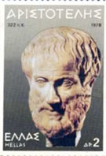
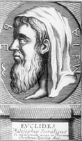
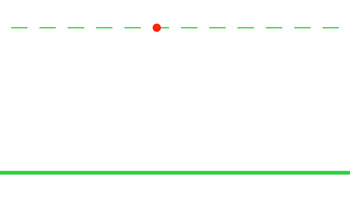
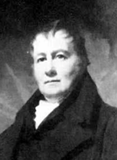
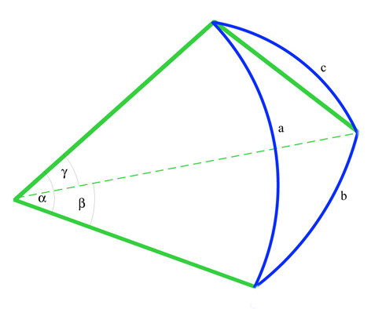

````
layout: resource
clearance: 3
title: Geometry --- A History from Practice to Abstraction
source: NRICH
keywords:
  - history
  - geometry
  - non-Euclidean geometry
  - projective geometry
resourceType: RT15
stids1:
  - G1
stids2:
pvids1:
pvids2:
  - PI6
  - PI8

````

### 1. Ancient and Classical Geometries
As an essential part of their daily lives, ancient cultures knew a considerable amount of geometry as practical measurement and as rules for dividing and combining shapes of different kinds for building temples, palaces and for civil engineering. For their everyday practical purposes, people lived on a 'flat' Earth. A 'straight line' was a tightly stretched rope, and a circle could be drawn by tracing round a fixed point.

<div class="media row">
  <div class="pull-left span3">



  </div>
  <div class="media-body span8">

Much of the knowledge of these peoples was well-known around the Mediterranean, and when the Greek civilisation began to assert itself in the 4th century BCE, philosophers like Aristotle (384-322 BCE), developed a particular way of thinking, and promoted a mode of discussion which required the participants to state as clearly as possible the basis of their argument. In this atmosphere, Greek Logic was born.

  </div>
</div>

<div class="media row">
  <div class="pull-left span3">



  </div>
  <div class="media-body span8">

During this period, Alexandria became one of the important centres of Greek learning and this is where Euclid's Elements of Mathematics was written in about 300 BCE. Following Aristotle's principles, Euclid based his mathematics on a series of definitions of basic objects like points, straight lines, surfaces, angles, circles and triangles, and axioms (or postulates). These were the agreed starting points for his development of mathematics.

  </div>
</div>

The first three postulates are about what can be done, the next one about equality of right angles and the final statement uses the sum of two right angles to define whether two lines meet:

* Draw a straight line from any point to any other point.
* Produce (extend) a finite straight line continuously in a straight line.
* Describe a circle with any centre and distance.
* All right angles are equal to each other.
* If a straight line falling on two straight lines makes the interior angles on the same side less than two right angles, then if the two lines are produced indefinitely, they will meet on that side where the angles are less than the two right angles.

<div class="media row">
  <div class="pull-left span3">

  

  </div>

  <div class="media-body span8">

#### The fifth postulate

Almost as soon as Euclid put his pen down, mathematicians and philosophers were having difficulty with the fifth postulate. In contrast to the short statements of the first four, the fifth looked as though it ought to be a theorem, not an axiom, meaning that it ought to be deducible from the other axioms. We know this from various logical analyses written by other mathematicians. In the fifth century CE, Proclus (411-485 CE) gave a simpler version of the fifth postulate:


  </div>
</div>

<div class="media row">
  <div class="pull-left span3">

  

  </div>

  <div class="media-body span8">

* Given a line and a point not on the line, it is possible to draw exactly one line through the given point parallel to the line.

  </div>
</div>


<div class="media row">
  <div class="pull-left span3">

  

  </div>

  <div class="media-body span8">

Today, this is known as Playfair's axiom, after the English mathematician John Playfair who wrote an important work on Euclid in 1795, even though this axiom had been known for over 1200 years!

  </div>
</div>


Arab mathematicians studied the Greek works, logically analysed the relatively complex statement of the fifth postulate, and produced their own versions.

#### Abul Wafa al-Buzjani (940-998)

Abul Wafa developed some important ideas in trigonometry and is said to have devised a wall quadrant [See Note 1 below] for the accurate measurement of the declination of stars. He also introduced the tangent, secant and cosecant functions and improved methods for calculating trigonometrical tables to 15° intervals and accurate to 8 decimal places. All this was done as part of an investigation into the Moon's orbit in his Theories of the Moon . The Abul Wafa crater is named after him.
As a result of his trigonometric investigations, he developed ways of solving some problems of spherical triangles.

<div class="media row well">
  <div class="pull-left span3">

  

  </div>

  <div class="media-body span8">

Greek astronomers had long since introduced a geometrical model of the universe. Abul Wafa was the first Arab astronomer to use the idea of a spherical triangle to develop ways of measuring the distance between stars on the inside of a sphere. In the accompanying diagram, the blue triangle with sides a, b, and c represents the distances between stars on the inside of a sphere. The apex where the three angles are marked is the position of the observer.

  </div>
</div>


Omar Khayyam (1048-1131)
Famous for his poetry, Omar Khayyam was also an outstanding astronomer and mathematician who wrote Commentaries on the difficult postulates of Euclid's book . He tried to prove the fifth postulate and found that he had discovered some non-Euclidean properties of figures.
Omar Khayyam
Omar Khayyam (1048-1131)

Omar Khayyan Quadrilateral
Omar Khayyam Quadrilateral


Omar Khayyam constructed the quadrilateral shown in the figure in an effort to prove that Euclid's fifth postulate could be deduced from the other four. He began by constructing equal line segments AD and BC perpendicular to AB. He recognized that if, by connecting C and D, he could prove that the internal angles at the top of the quadrilateral are right angles, then he would have shown that DC is parallel to AB. Although he showed that the internal angles at the top are equal (try it yourself) he could not prove that they were right angles.

Nasir al-Din al-Tusi (1201-1274)
Nasir al-Din al-Tusi
Nasir al-Din al-Tusi (1201-1274)
Al-Tusi wrote commentaries on many Greek texts and his work on Euclid's fifth postulate was translated into Latin and can be found in John Wallis' work of 1693.
He criticised Euclid's proposition I, 28
"If a straight line falling on two straight lines makes the exterior angle equal to the interior and opposite angle on the same side, or the sum of the interior angles on the same side equal to two right angles, then the straight lines are parallel to one another."


Al-Tusi diagram
Al-Tusi's diagram
Al-Tusi's original diagram
Al-Tusi's original diagram

Al-Tusi's argument looked at the second part of the statement. Given two lines, AB and CD in the plane and a series of perpendiculars to CD drawn from PQ to XY so that they meet AB. On each side of these perpendiculars, one angle is acute (towards A), and the other obtuse (towards B). Clearly the perpendicular PQ is longer than each of the others and finally longer than XY. The opposite is also true; perpendicular XY is shorter than all those up to and including EF. So, if any pair of these perpendiculars is chosen to make a rectangle, the rectangle will contain an acute angle (on the A side) and an obtuse angle (on the B side). So how can we ensure that the perpendiculars are the same length, or show that both angles are right angles?

One of al-Tusi's most important mathematical contributions was to show that the whole system of plane and spherical trigonometry was an independent branch of mathematics . In setting up the system, he discussed the comparison of curved lines and straight lines. The 'sine formula' for plane triangles had been known for some time, and Al-Tusi established an analogous formula for spherical triangles:


Plane triangle sine rule
Plane triangle sine rule


Spherical triangle sine rule
Spherical triangle sine ruleGreat circles
Great Circles Triangle


The important idea here is that Abul Wafa and al-Tusi were dealing with the real problems of astronomy and between them they produced the first real-world non-Euclidean geometry which required calculation for its justification as well as logical argument. It was the ' Geometry of the Inside of a Sphere '.

2. Renaissance and Early Modern Developments
The Painters' Perspective
In the Middle Ages the function of Christian Art was largely hierarchical. Important people were made larger than others in the picture, and sometimes to give the impression of depth, groups of saints or angels were lined up in rows one behind the other like on a football terrace. Euclid's Optics provided a theoretical geometry of vision, but when the optical work of Al-Haytham (965-1039) became known, artists began to develop new techniques. Pictures in correct perspective appear in the fourteenth century, and methods of constructing the 'pavement' were no doubt handed down from master to apprentice.

Leone Battista Alberti (1404-1472) published the first description of the method in 1435, and dedicated his book to Fillipo Brunelleschi (1377-1446) who is the person who gave the first correct method for constructing linear perspective and was clearly using this method by 1413.
Alberti
Leone Battista Alberti (1404-1472)

Alberti Perspective Construction
Alberti Perspective Construction


Alberti's method here is called distance point construction. In the centre of the picture plane, mark a line H (the horizon) and on it mark V (the vanishing point). Draw a series of equally spaced lines from V to the bottom of the picture. Then mark any point Z on the horizon line and draw a line from Z to the corner of the frame underneath H. This line will intersect all the lines from V. The points of intersection give the correct spaces for drawing the horizontal lines of the 'pavement' on which the painting will be based.

Piero della Francesca (1412-1492) was a highly competent mathematician who wrote treatises on arithmetic and algebra and a classic work on perspective in which he demonstrates the important converse of proposition 21 in Euclid Book VI:b
"Figures which are similar to the same rectilinear figure are also similar to one another".
Euclid uses this proposition to establish that similarity is a transitive relation.
Piero's converse showed that if a pair of unequal parallel segments are divided into equal parts, the lines joining corresponding points converge to the vanishing point.

Piero della Francesca

Piero della Francesca (1412-1492)


Piero Euclid VI, 21 diagram


Piero's argument was based on the fact that each of the pairs of triangles ABD and AHK,ADE and AKL, etc. are similar, because HK is parallel to BC, and that the ratio AB to BC is the same as AH to HI. This implies that all the converging lines meet at A, the vanishing point (at infinity).

Other famous artists improved on these methods, and in 1525 Albrecht Durer (1471-1528) produced a book demonstrating a number of mechanical aids for perspective drawing.
Perspective picture by Durer

Durer "Reclining woman" perspective picture

Durer
Albrecht Durer (1471-1528)


Desargues and Projective Geometry
In 1639, Girard Desargues (1591-1661) wrote his ground-breaking treatise on projective geometry. He had earlier produced a manual of practical perspective for Architects and another on stone cutting for Masons, but his approach was theoretical and difficult to understand. In his 1639 treatise he introduced many new fundamental concepts. The term 'point at infinity' (the vanishing point) appears for the first time. He also uses the ideas of a 'cone of vision' and talks about 'pencils of lines', like the lines emanating from the vanishing point, (and if you can have a point at infinity, why not more, to make lines at infinity?).

This was a completely new kind of geometry. The fundamental relationships were based on ideas of 'projection and section' which means that any rigid Euclidean shape can be transformed into another 'similar' shape by a perspective transformation .
A square can be transformed into a parallelogram (think of shadow play) and while the number and order of the sides remain the same, their length varies.

Durer cone section
Durer's cone picture

The new geometry was not recognized at the time, because Desargues' technical language was difficult, and also because René Descartes' coordinate geometry published three years earlier was so popular. In the late 18th century Desargues' work was rediscovered, and developed both theoretically and practically into a coherent system, with central concepts of invariance and duality .

In Projective geometry lengths, and ratios of lengths, angles and the shapes of figures, can all change under projection. Parallel lines do not exist because any pair of distinct lines intersect in a point.
Properties that are invariant under projection are the order of three or more points on a line and the cross ratio, among four points, A,B,C,D, so that ACBC=ADBD
Another important concept in projective geometry is duality . In the plane, the terms 'point' and 'line' are dual and can be interchanged in any valid statement to yield another valid statement.

See Leo's articles on Proof (for the Invariants and Projection and Section) and on the Four Colour Theorem (for Duality).

3. Modern Geometries
In spite of the practical inventions of Spherical Trigonometry by Arab Astronomers, of Perspective Geometry by Renaissance Painters, and Projective Geometry by Desargues and later 18th century mathematicians, Euclidean Geometry was still held to be the true geometry of the real world. Nevertheless, mathematicians still worried about the validity of the parallel postulate.

In 1663 the English mathematician John Wallis had translated the work of al-Tusi and followed his line of reasoning. To prove the fifth postulate he assumed that for every figure there is a similar one of arbitrary size. However, Wallis realized that his proof was based on an assumption equivalent to the parallel postulate.

Saccheri title page

Saccheri's title page

 
Girolamo Saccheri (1667-1733) entered the Jesuit Order in 1685. He went to Milan, studied philosophy and theology and mathematics. He became a priest and taught at various Jesuit Colleges, finally teaching philosophy and theology at Pavia, and holding the chair of mathematics there until his death. Saccheri knew about the work of the Arab mathematicians and followed the reasoning of al-Tusi in his investigation of the parallel postulate, and in 1733 he published his famous book, Euclid Freed from Every Flaw.


In his first proposition at the beginning of his book, Saccheri constructed a quadrilateral in a similar manner to that of Omar Khayyam (above) and proved that the angles ADB and BCA are equal. He then considered the length of the upper side of the quadrilateral CD, and in Proposition III set up the three possibilities, depending on whether CD is equal to, or less, or greater than the base AB.
These possibilities are equivalent to:

Hypothesis I : There is exactly one parallel (the right angle case, CD=AB)
Hypothesis II: There are no parallels (the obtuse angle case, CD< AB)
Hypothesis III : There are more than one parallel (the acute angle case, CD> AB)

Saccheri Hypothesis Diagram
Saccheri Hypotheses Diagram

Saccheri assumes that (i) a straight line divides the plane into two separate regions and (ii) that straight line can be infinite in extent. These assumptions are incompatible with the obtuse angle case, and so this is rejected. However, they are compatible with the acute angle case, and we can see from his diagram (fig. 33) and Proposition XXXII below that he is treating the intersection at infinity as a finite point, and this is where his contradiction lies.
Saccheri Fig 33

Proposition XXXII
"Now I say there is (in the hypothesis of acute angle) a certain determinate acute angle BAX drawn under which AX (fig. 33) only at an infinite distance meets BX, and thus is a limit in part from within, in part from without; on the one hand of all those which under lesser acute angles meet the aforesaid BX at a finite distance; on the other hand also of the others which under greater acute angles, even to a right angle inclusive, have a common perpendicular in two distinct points with BX."
 
To us now, the curved line AX looks like an asymptote, but he says that AX meets BX "at an infinite distance" so that in the next Proposition XXXIII he states:
"The hypothesis of acute angle is absolutely false; because it is repugnant to the nature of the straight line".
The irony is that in the next twenty or so pages, in order to show that the acute angle case is impossible, he demonstrates a number of elegant theorems of non-Euclidean geometry! It was clear that Saccheri could not cope with a perfectly logical conclusion that appeared to him to be against common sense.


Saccheri's work was virtually unknown until 1899 when it was discovered and republished by the Italian mathematician, Eugenio Beltrami (1835-1900). As far as we know it had no influence on Lambert, Legendre or Gauss.

Lambert
Johan Heinrich Lambert
(1728-1777)


Johan Heinrich Lambert (1728-1777) followed a similar plan to Saccheri. He investigated the hypothesis of the acute angle without obtaining a contradiction. Lambert noticed the curious fact that, in this new geometry, the angle sum of a triangle increased as the area of the triangle decreased.


Adrien-Marie Legendre (1752-1833) spent many years working on the parallel postulate and his efforts appear in different editions of his Éléments de Géométrie. Legendre proved that the fifth postulate is equivalent to the statement that the sum of the angles of a triangle is equal to two right angles . Legendre also obtained a number of consistent but counter-intuitive results in his investigations, but was unable to bring these ideas together into a consistent system.

Many of the consequences of the Parallel Postulate, taken with the other four axioms for plane geometry, can be shown logically to imply the Parallel Postulate. For example, these statements can also be regarded as equivalent to the Parallel Postulate.
In any triangle, the three angles sum to two right angles.
In any triangle, each exterior angle equals the sum of the two internally opposite angles.
If two parallel lines are cut by a transversal, the alternate interior angles are equal, and the corresponding angles are equal.
Carl Friedrich Gauss (1777-1855)
Gauss
Carl Friedrich Gauss (1777-1855)


Gauss was the first person to truly understand the problem of parallels. He began work on the fifth postulate by attempting to prove it from the other four. But by 1817 he was convinced that the fifth postulate was independent of the other four, and then began to work on a geometry where more than one line can be drawn through a given point parallel to a given line. He told one or two close friends about his work, though he never published it and in a private letter of 1824 he wrote:
"The assumption that (in a triangle) the sum of the three angles is less than 180o leads to a curious geometry, quite different from ours, but thoroughly consistent, which I have developed to my entire satisfaction".


The final breakthrough was made quite independently by two men, and it is clear that both Bolyai and Lobachevski were completely unaware of each other's work.

Lobachevski
Nikolai Ivanovich Lobachevski
(1792-1856)


Nikolai Ivanovich Lobachevski (1792-1856) did not try to prove the fifth postulate but worked on a geometry where the fifth postulate does not necessarily hold. Lobachevski thought of Euclidean geometry as a special case of this more general geometry, and so was more open to strange and unusual possibilities. In 1829 he published the first account of his investigations in Russian in a journal of the university of Kazan but it was not noticed. His original work, Geometriya had already been completed in 1823, but not published until 1909.


Lobachevski explained how his geometry works, "All straight lines which in a plane go out from a point can, with reference to a given straight line in the same plane, be divided into two classes - into cutting and non-cutting. The boundary lines of the one and the other class of those lines will be called parallel to the given line."

The red line is the boundary, the 'parallel' to the line BC.


Lobachevski Diagram


Lobachevski tried to get his work Geometrical investigations on the theory of parallels recognized, and an account in French in 1837 brought his work on non-Euclidean geometry to a wide audience but the mathematical community was not yet ready to accept these revolutionary ideas.


Lobachevski Diagram


János Bolyai (1802-1860) was the son of the mathematician Farkas Bolyai, a friend of Gauss. Farkas had worked on the problem of the fifth postulate, but had not been able to make any headway.
Bolyai
János Bolyai (1802-1860) )


In 1823 young János wrote to his father saying, "I have discovered things so wonderful that I was astounded ... out of nothing I have created a strange new world." However it took János two more years before it was completed and his work was published as an appendix to his father's text-book. János had shown that a consistent geometry using the acute angle hypothesis case was possible.


János Bolyai set out to investigate the three basic hypotheses of the right, obtuse, and acute angles by separating the case where the fifth postulate was true (the right angle case) from the cases where it was not true. On this basis he set up two systems of geometry, and searched for theorems that could be valid in both.

János Bolyai's work was read by Gauss who recognized and gave credit to the young genius. However, when Gauss later explained to János that he himself had made these discoveries some years before, Janos was devastated. Later, János learned that Lobachevski had anticipated his work which disappointed him even more. He continued to work in mathematics, presenting some original ideas, but his enthusiasm and health deteriorated and he never published again.

Lobachevski and Bolyai had discovered what we now call Hyperbolic Geometry. This is the geometry of the acute angle hypothesis where a 'line' is no longer a straight line and there are many possible lines through a given point which do not intersect another line. This is very difficult to visualize, and for people brought up to believe Euclidean geometry was 'true' this was counter-intuitive and unacceptable.

Beltrami
Eugenio Beltrami (1835-1900)


It was not until Beltrami produced the first model for hyperbolic geometry on the surface of a pseudo-sphere in 1868 that many mathematicians began to accept this strange new geometry.


Half pseudo sphere
Imagine a circular polar grid (like a dart board) pulled up from the origin. It forms a trumpet-like surface. Any triangle drawn on this grid will become even more distorted when an apex is near the origin. All the lines going up the surface are asymptotes to a single central line rising vertically from the origin. These lines are all 'parallel' lines passing through a single limit point at infinity.

Tractrix
If the Tractrix is rotated about its vertical axis, the surface formed will be a complete Pseudo-sphere.


Poincare disc model
In the Poincare Model, all 'lines' are arcs of circles, except for the diameter (the arc of a circle with infinite radius). 'Parallel' lines are thought of as asymptotes where the limit point is on the circumference. With this model many 'parallels' can pass through the same point. This disc has a basic four-fold symmetry. The Yellow Poincare Disc has symmetry order seven. Maurits Escher used a six-fold symmetry for his "Circle Limit IV" engraving - the picture with the interlocking angels and devils. For more on Escher see: http://www.mcescher.com/


Gradually other models helped to make the new ideas more secure and in 1872 the famous German mathematician Felix Klein (1849-1925) produced his general view of geometry by unifying the different Spherical, Perspective Projective and Hyperbolic geometries with others as sets of axioms and properties invariant under the action of certain transformations. In this way, mathematicians at last became free to think of geometry in the abstract as a set of axioms, operations and logical rules that were not tied to the physical world.


For pedagogical notes: Use the notes tab at the top of this article or click here .


Notes
1. Wall quadrants were invented and used for many years by astronomers for measuring the altitude of heavenly bodies. They have been specially built as part of ancient observatories, and as they became larger had to be supported by solid walls to keep them steady. It was believed that the larger the instrument was, the more accurate were the results obtained. It is true that the larger the instrument is, the easier it is to divide the scale of the quadrant into degrees, minutes and seconds. However, the accuracy can also depend on other things like the sighting instrument. For example, telescopes were not developed well enough to be reliable until the early 18th century, and because the mounting was fixed, it had limited use. In spite of the problems, Arab astronomers were able to achieve an accuracy of about 20 seconds of arc.
Wall quadrant

Weblinks
These are the most reliable and accurate links. A quick search in Wikipedia often gives basic information, but be careful. It is always best to cross-check details with other sites.

For all biographical details and special pages on non-Euclidean geometries and Mathematics and Art the MacTutor site at St Andrews University go to:
http://www-history.mcs.st-and.ac.uk/history/

For more detail on Mathematical techniques in Astronomy go to the 'Starry Messenger' site of the History of Science at Cambridge University:
http://www.hps.cam.ac.uk/starry/starrymessenger.html

The Cut-the-Knot site has a good set of pages on non-Euclidean Geometry:
http://www.cut-the-knot.org/triangle/pythpar/NonEuclid.shtml

For excellent exposition and explanations of Euclid with Java applets go to David Clark's site at:
http://aleph0.clarku.edu/~djoyce/java/elements/toc.html

'The Origins of Perspective' is section 11 of a more extensive course on Art and Architecture based at Dartmouth college:
http://www.dartmouth.edu/~matc/math5.geometry/unit11/unit11.html

And, if you have on-line access to Encyclopaedia Britannica or the Dictionary of Scientific Biography, then of course these give you much greater detail if you need it.
Articles
Some books that open us to the range and fascination of cultural links are:
Michele Emmer, (1993) The Visual Mind; Art and Mathematics MIT Press

J.L. Heilbron, (1998) Geometry Civilised; History, Culture and Technique . Clarendon Press, Oxford.

AND a book to look out for:

Eleanor Robson and Jackie Stedall (Editors) (December 2008), The Oxford Handbook of the History of Mathematics . Oxford University Press

