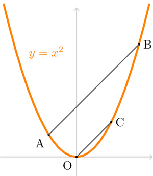

````
title: Parabella
layout: resource
alias: Problem
source: NRICH
sourceUrl: http://nrich.maths.org/785?mobile=1
clearance: 3
keywords:
  - parabola
  - line
  - parallel
resourceType: RT12
stids1:
  - G2
stids2:
  - A2
pvids1:
pvids2:

````

Take any two points $A$ and $B$ on the parabola $y = x^2$.

Draw the line $OC$ through the origin, parallel to $AB$, cutting the parabola again at $C$.

Let $A$ have coordinates $(a,a^2)$, let $B$ have coordinates $(b,b^2)$ and let $C$ have coordinates $(c,c^2)$.

Prove that $a+b = c$.



Imagine drawing another parallel line $DE$, where $D$ and $E$ are two other points on the parabola.  Extend the ideas of the previous result to prove that the midpoints of each of the three parallel lines lie on a straight line.
