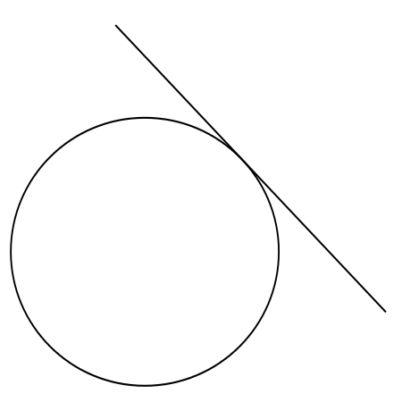
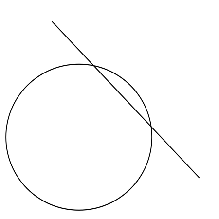
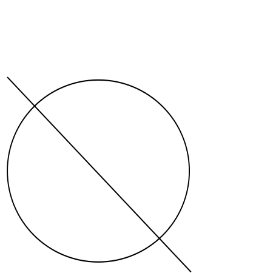
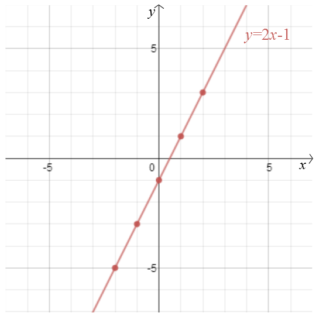
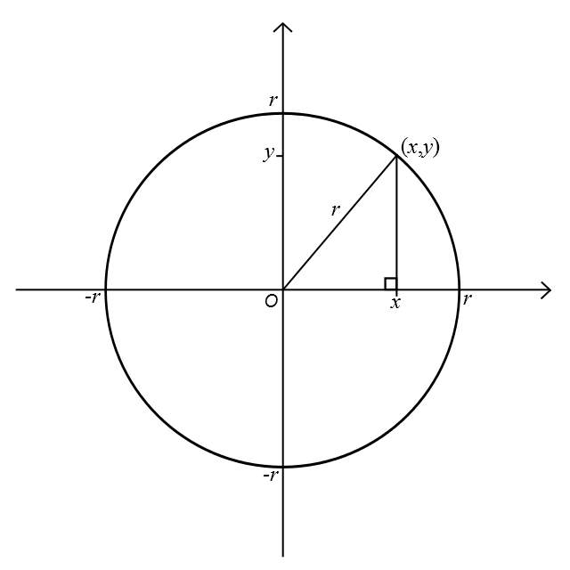
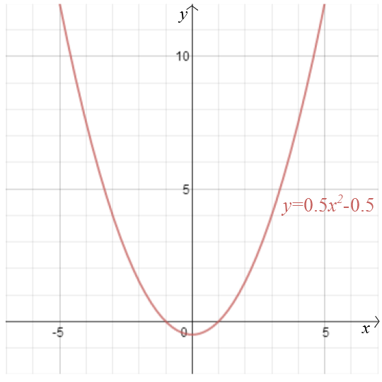
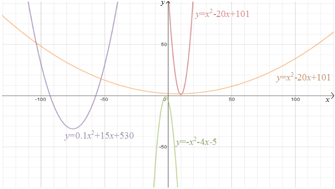
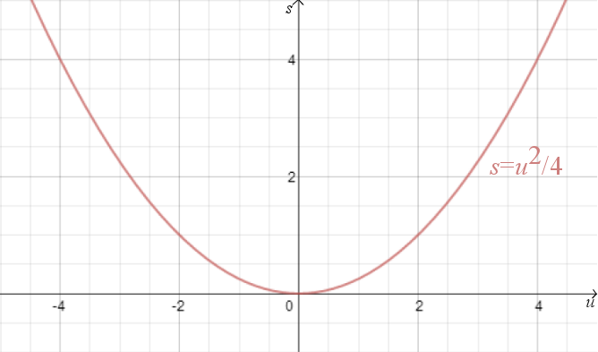
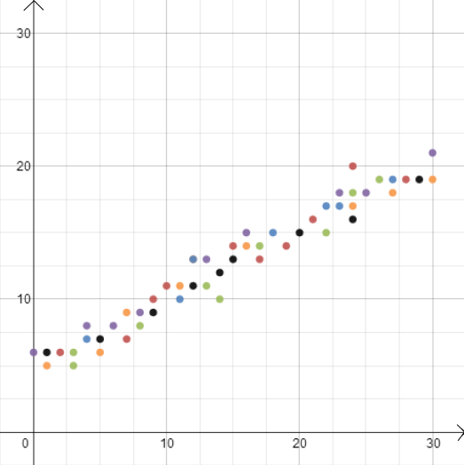
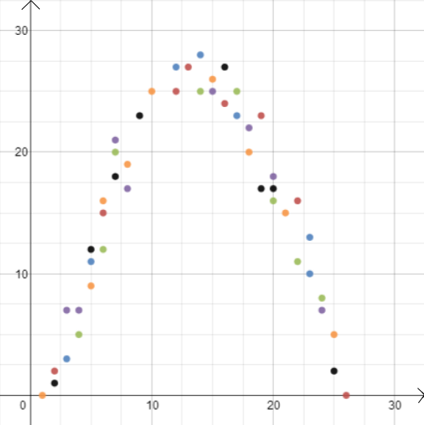

````
layout: resource
title: Cartesian coordinates
clearance: 3
keywords:
  - Descartes
  - coordinates
  - algebraic geometry
  - Cartesian coordinates
  - line
  - circle
  - intersection
  - parabola
  - quadratic
resourceType: RT15
stids1:
  - G2
  - E2
stids2:
  - G4a
pvids1:
pvids2:
  - PI1
  - PI8

````

How do you remember the spot on a desert island where you buried your treasure? You pick a landmark, say a palm tree, and measure how many steps North/South and how many steps East/West you have to go from that landmark to get to the treasure. It’s a simple idea but, surprisingly, mathematicians took centuries to develop its full potential in their own field. When they finally did, it revolutionised mathematics by bringing together two areas that on the face of it have little to do with each other: algebra and geometry.

When we start learning geometry we usually think of simple shapes like lines, triangles and circles in the two-dimensional plane. You can construct these and more complicated shapes using a ruler, compasses and protractor. The ancient Greeks were masters at this type of geometry: using just compasses and a straight-edge (an unmarked ruler) they were able to construct a range of shapes and they could even prove mathematical results, such as Pythagoras’ theorem, using these simple tools.

There are certain things, however, that you cannot do using these basic methods. Two shapes, say a line and a circle, may or may not intersect, and they may intersect in different ways: perhaps the line just touches the circle, perhaps it shaves a little arc off it, or perhaps it cuts it in half. To record this information you need a way of describing the locations of the shapes.

<div class="row">
<div class="offset1 span3 grow2">

 

</div>

<div class="span3 grow2">



</div>

<div class="span3 grow2">



</div>
</div>

This is where the treasure island idea comes in useful. It illustrates what is called the _Cartesian coordinate system_. Choose a point in the plane, called the _origin_, and draw two perpendicular axes through it, one horizontal and one vertical. Any point in the plane can be reached from the origin by travelling a certain distance $x$ along the horizontal axis and a certain distance $y$ along the vertical axis. The numbers $(x,y)$ are the coordinates of the point. The origin itself has coordinates $(0,0)$. The part of the horizontal axis (also called the $x$-axis) that lies to the left of the origin and the part of the vertical axis (the $y$-axis) below the origin are described by negative numbers.

Cartesian coordinates are named after the 17th century French philosopher and mathematician René Descartes. There is a (probably untrue) story that Descartes invented these coordinates while lying in bed watching a fly on the ceiling and wondering how to describe its location. Descartes’ penchant for lying in bed until noon may actually have been the cause of his demise, which occurred in Stockholm in 1650. Descartes was in Sweden to act as maths tutor to Queen Christina, who unfortunately preferred to work early in the morning.  According to some reports it was these early hours and the Scandinavian temperatures which caused the pneumonia that eventually killed him. Others have suggested that he was poisoned by a Catholic priest worried about Descartes’ radical theology.

Either way, the Cartesian coordinate system is one of Descartes’ most important legacies (although he was not the only person to have the idea). It allows us to answer geometric problems using algebra and to visualise algebraic relationships that would otherwise remain quite abstract. Take for example the equation
$$y = 2x-1.$$
We can plot the graph of this function in a Cartesian coordinate system by plotting all points whose coordinates are of the form $(x,2x-1)$: points such as $(0, -1)$, $(1, 1)$, $(2,3)$, $(-1,-3)$, $(-2,-5)$, $(-\frac{1}{2}, -2)$, and $(1.73, 2.46)$. In this case the graph is a straight line that meets the $y$-axis at the point $(0,-1)$ and has a slope of $2$.




More generally every straight line is given by an equation of the form
$$y=mx+b,$$
where $m$ gives you the slope of the line and $(0,b)$ is the point at which it crosses the $y$-axis.  A vertical line which doesn’t cross the $y$-axis is given by an equation of the form $x=c$.  In this case $(c,0)$ is the point at which it crosses the $x$-axis.

What about a circle? A circle consists of all those points that lie at equal distance $r$ from a given point $m$. Let’s suppose that $m$ is the point $(0,0)$. From Pythagoras’ theorem we know that if a point $(x, y)$ lies at distance $r$ from $(0,0)$, then
$$x^2+y^2=r^2.$$





This therefore is the equation of a circle of radius $r$ centred on the origin. You can work out for yourself that a circle of radius $r$ centred on the point $(a,b)$ has the equation
$$(x-a)^2 + (y-b)^2 = r^2.$$
But here is a more complicated question: what shape do you get when you consider all points that lie at equal distance from a given point and a given line? Without a coordinate system, you might draw the point and the line and experiment with your ruler or compasses. You could draw a few points that lie at an equal distance from both and see if you can guess the overall shape.

Armed with a coordinate system, though, the answer becomes a lot easier and much more precise. Suppose that the given point is at distance $1$ from the given line. Let’s place the given point at the origin and the given line so that it is horizontal, given by the equation
$$y=-1.$$
By Pythagoras’ theorem the distance of any point $(x,y)$ from $(0,0)$ is $\sqrt{x^2 + y^2}$. The distance from a point $(x,y)$ to the line $y = -1$ is $|y+1|$ (we use the modulus here because the $y$-coordinate might be negative). If those two are equal, then
$$|y+1| = \sqrt{x^2 + y^2}.$$
Squaring both sides gives
$$y^2 + 2y +1 = x^2 + y^2$$
Rearranging gives
$$y = \frac{x^2}{2} - \frac{1}{2}.$$
So any point at equal distance from the point $(0,0)$ and the line $y=-1$ has coordinates $\left(x, \frac{x^2}{2} - \frac{1}{2}\right)$. You can check for yourself that the converse is also true: every point with these coordinates lies at equal distance from the the point $(0,0)$ and the line $y=-1$.



We can plot the graph of this function to see the required shape, which turns out to be a parabola. In fact, every _quadratic function_
$$y = ax^2 + bx + c$$
for $a$, $b$ and $c$ constants, gives us a parabola. This familiar shape, which can come in so many subtle variations---long and thin or squat and flat---is captured by this handy algebraic expression. The fact that today the terms “quadratic function” and “parabola” are almost considered synonymous highlights just how successful Descartes’ idea has been. More generally, any algebraic relationship between two variables $x$ and $y$ gives us a curve that we can plot using Cartesian coordinates.

<div class="grow3">



</div>

The algebraic representation makes it easy to answer a whole range of geometric questions. To work out the intersection points of the line given by
$$y = x$$
and the parabola above we simply note that the $y$ coordinate of any point $(x,y)$ lying on both must satisfy both equations, so
$$y = x =  \frac{x^2}{2} - \frac{1}{2}.$$
This gives
$$x^2 - 2x - 1 = 0.$$
Solving the quadratic equation we get
$$x = 1+\sqrt{2}$$
and
$$x = 1-\sqrt{2},$$
so the points of intersection are at
$$(1+\sqrt{2},1+\sqrt{2}) \textrm{ and } (1-\sqrt{2},1-\sqrt{2}).$$

Apart from solving geometric problems, Cartesian coordinates also help visualise algebraic relationships. For example, suppose a car is travelling at speed $u$ and the driver is applying the brakes, resulting in a _constant deceleration_ of, for example, $-4$ metres/seconds$^2$. The stopping distance $s$---the distance the car covers before it come to a halt---is given by the algebraic relationship
$$s = -\frac{u^2}{2 \times (-4)} = \frac{u^2}{8}.$$
Plotting this using Cartesian coordinates brings home just how important it is to slow down in urban areas, because the stopping distance increases rapidly with $u$.



In this example we knew the relationship between two variables because it can be derived from the laws of physics. But Cartesian coordinates are also useful when you suspect that two variables are related but you don’t know how.  Suppose we think that there is a relationship between the profit made by an ice cream seller and the outside temperature. To find out what that relationship might be, we can measure temperature and profit over, say, the course of a year and plot the values against each other, with temperature recorded on the $x$-axis and profit on the $y$-axis. We can then see whether we can spot a pattern. In figure 9 we might guess that the relationship is _linear_, and we can try to find the straight line
$$y=mx+b$$
that best fits our data (there are methods for finding this best fit). In figure 10 we might guess that the relationship is quadratic and again we can try to find the function
$$y = ax^2 + bx + c$$
that best fits the data.





Cartesian coordinates played a major role in the development of calculus in the second half of the 17th century.  Calculus makes it possible to work out attributes of curves such as their slope at a given point or the area of the region that lies between a curve and the $x$-axis.  These can have physical interpretations too. For example, if we plot the distance a car travels against the time it has been travelling, the slope of the resulting curve at a given time---the rate of change of distance with respect to time---represents the speed at which the car was travelling at that moment in time: it is the derivative of the function that gives us distance in terms of time.

We can also go up a dimension by considering a third axis perpendicular to the first two, which you can imagine as coming out of your sheet of paper and pointing at you. Using such a three-dimensional system you can now represent three-dimensional objects and visualise how a third variable $z$ depends on your first two, $x$ and $y$. 

These examples should give you some sense of why coordinates have become so indispensable in all areas of science, from physics to astronomy and engineering, and also in visual industries to produce computer graphics or the computer generated imagery we admire in movies and games.

In mathematics itself the link between algebra and geometry has culminated in a whole area called _algebraic geometry_, which holds a fascination of its own. Perhaps the most famous result that has emerged from this area is _Fermat’s Last Theorem_, named after a contemporary of Descartes, Pierre de Fermat, who also contributed significantly to the development of the Cartesian coordinate system. Fermat was considering a question that links geometry to number theory. According to Pythagoras’ theorem, if $a$, $b$ and $c$ are the sides of a right-angled triangle and $c$ is the side opposite the right angle, then $a^2 + b^2 = c^2$. There are infinitely many triples of whole numbers $a$, $b$ and $c$ which satisfy this relationship; $(3,4,5)$ is an example.

Now suppose we change the exponent and consider expressions such as
$$a^3+b^3=c^3$$
and
$$a^4+b^4=c^4$$
and more generally
$$a^n+b^n=c^n$$
where $n$ is a natural number greater than 2. Can we still find positive whole numbers $a$, $b$ and $c$ satisfying the equation? Fermat suspected that we can’t and he scribbled as much in the margin of his maths text book, saying he had a "marvellous proof" for that fact which the margin was too narrow to contain.

That scribble was to haunt mathematicians for over 350 years. It was not until 1993 that a proof of this seemingly innocuous result was finally announced by the mathematician Andrew Wiles. Wiles had made extensive use of algebraic geometry. In particular, he had used results concerning the _elliptic curves_ described by points in the plane whose coordinates satisfy 
$$y = x(x-a^n)(x-b^n).$$
Descartes' contemplation of a fly has come a long way!
