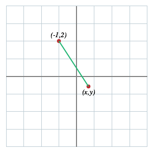
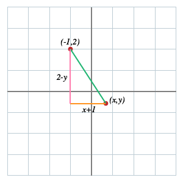
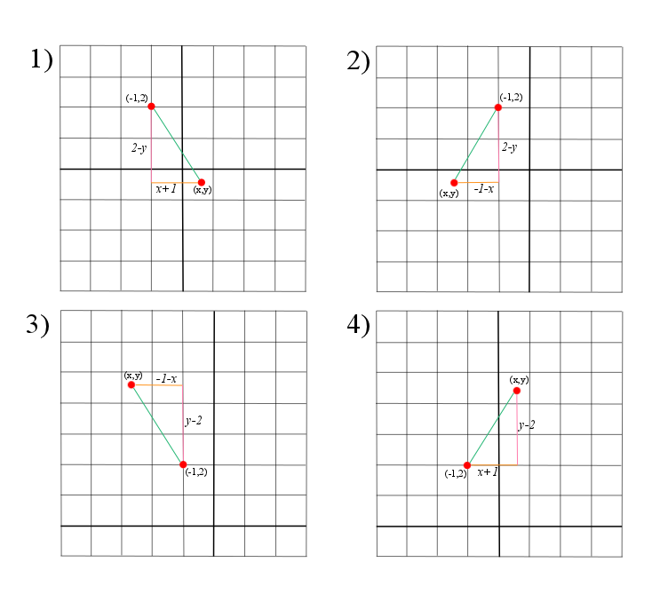

````
layout: resource
clearance: 1
keywords:
  - circle
  - equation
  - Pythagoras
resourceType: RT3
stids1:
  - G2
  - E2
stids2:
pvids1: 
pvids2: 

````

What do we mean by a _circle_?

It's the set of all points at some fixed distance from some fixed point.

For example, we might talk about the circle of radius $3$ with centre $(-1,2)$---this is the set of all points that are at distance $3$ from $(-1,2)$.

Now we're going to try to express this set of points as a set of solutions to an equation, in much the same way that we can describe a line as the set of solutions to an equation.  For example, the line with gradient $\frac{1}{2}$ passing through $(0,1)$ is precisely the set of all points $(x,y)$ such that $2y = x + 2$.

When is the point $(x,y)$ at distance $3$ from $(-1,2)$?

Here's a useful picture.

<!-- ADD PICTURE OF AXES WITH THESE TWO POINTS MARKED AND A LINE SHOWING THE DISTANCE BETWEEN THEM -->


The coordinate system gives us a very natural way to get a helpful right-angled triangle from this.

<!-- ADD PICTURE SHOWING RIGHT-ANGLED TRIANGLE WITH SHORTER SIDE LENGTHS LABELLED -->


If the point $(x,y)$ were placed differently relative to $(-1,2)$, then we might get different triangles.

<div class="well">

####Exercise

Find all the possible diagrams, and the side lengths of the resulting triangles.

<button type="button" class="btn btn-action" data-toggle="collapse" data-target="#answer1">
Answer
</button>

<div id="answer1" class="collapse">

</div>

</div>

Now Pythagoras's theorem helps us to find the distance between the points $(x,y)$ and $(-1,2)$: it's $$\sqrt{(x+1)^2 + (2-y)^2}.$$

<div class="well">####Exercise

Find the corresponding expressions for the distances in the other possible diagrams.

<button type="button" class="btn btn-action" data-toggle="collapse" data-target="#answer2">
Answer
</button>

<div id="answer2" class="collapse">
The expressions for the distance between $(-1,2)$ and $(x,y)$ in each of the above diagrams are:  

1) $\sqrt{(x+1)^2+(2-y)^2}$,  
2) $\sqrt{(-1-x)^2+(2-y)^2}$,  
3) $\sqrt{(-1-x)^2+(y-2)^2}$,  
4) $\sqrt{(x+1)^2+(y-2)^2}$.  
  
Using the fact that $(-a)^2=a^2$ for any real number $a$, we can see that these expressions are all equivalent!
</div>

</div>

So $(x,y)$ lies on the circle of radius $3$ with centre $(-1,2)$ if, and only if, $$\sqrt{(x+1)^2 + (2-y)^2} = 3.$$

This, in turn, is satisfied if, and only if, $$(x+1)^2 + (2-y)^2 = 9.$$  (In one direction this is clear: by squaring both sides of the first equation we obtain the second.  In the other direction, we can use the fact that $\sqrt{(x+1)^2 + (2-y)^2}$ must be positive to justify taking the positive root on both sides.)

So the equation of the circle of radius $3$ with centre $(-1,2)$ is $$(x+1)^2 + (2-y)^2 = 9.$$

<div class="well">####Exercise

Expand out the brackets and experiment with different ways of writing this equation.  Which way(s) do you find most convenient, and why?</div>

<div class="well">####Exercise

Pick a radius and a centre, and find the equation of the corresponding circle, with an explanation.  Repeat until you feel confident.</div>

