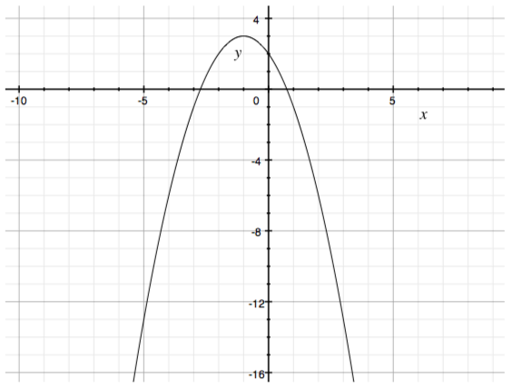
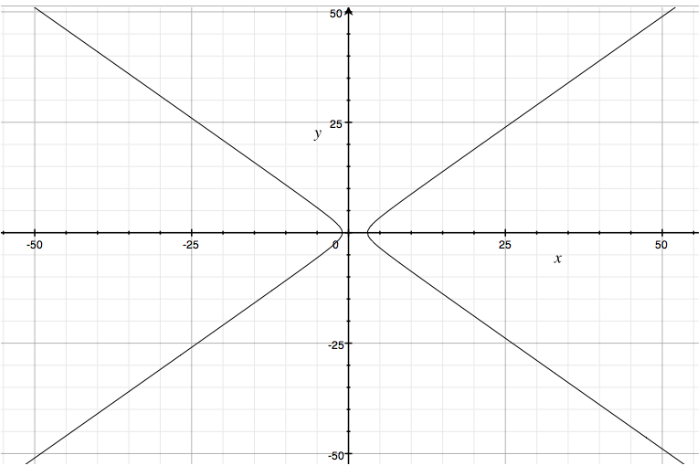
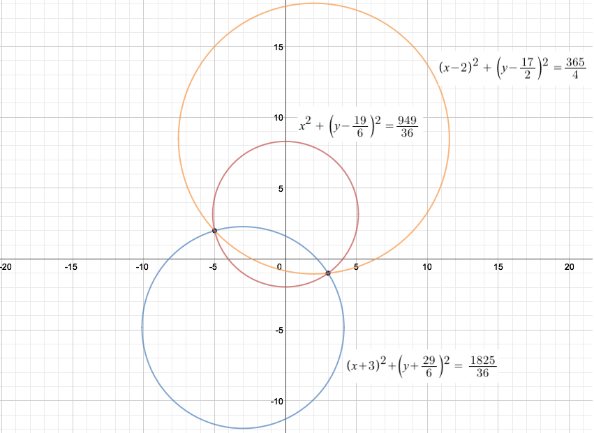
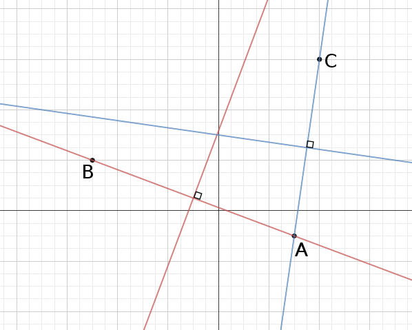

````
alias: Solution
````

1. A circle of centre $(a,b)$ and radius $r$ has equation: 
$$(x-a)^2 + (y-b)^2 = r^2.$$

	* Centre $(a+1,b)$, radius $r$: $(x-a-1)^2 + (y-b)^2 = r^2$ 
	* Centre $(a-1,b)$, radius $r$: $(x-a+1)^2 + (y-b)^2 = r^2$ 
	* Centre $(a,b+1)$, radius $r$: $(x-a)^2 + (y-b-1)^2 = r^2$ 
	* Centre $(a,b-1)$, radius $r$: $(x-a)^2 + (y-b+1)^2 = r^2$
	* Centre $(-a,b)$, radius $r$: $(x+a)^2 + (y-b)^2 = r^2$
	* Centre $(b,a)$, radius $r$: $(x-b)^2 + (y-a)^2 = r^2$
	* Centre $(a-b,0)$, radius $r$: $(x-a+b)^2 + y^2 = r^2$
	* Centre $(2a,b)$, radius $r$: $(x-2a)^2 + (y-b)^2 = r^2$
	* Centre $(a,b)$, radius $2r$: $(x-a)^2 + (y-b)^2 = 4r^2$
	* Centre $(a,b)$, radius $\frac{1}{3}r$: $(x-a)^2 + (y-b)^2 = \frac{1}{9}r^2$
	* Centre $(a,b)$, radius $r+1$: $(x-a)^2 + (y-b)^2 = (r+1)^2$

2.  * $(x-\pi)^2 + (y+2)^2 = 3$ is the equation of a circle with centre $(\pi,-2)$ and radius $\sqrt{3}$.
    * There are no real values of $x$ and $y$ that satisfy the equation $(x+1)^2 + (y-4)^2 = -1$, so we can't plot this in the $x$--$y$ plane.
    * $x^2 + 2x + y = 2$ can be rearranged to give $y = -x^2-2x+2$, which is the standard form of a quadratic equation, and so describes a parabola:
	
    

    * $x^2 + y^2 = 4$ is the equation of a circle centred at the origin with radius $2$.
    * $(x-1)^2 + y^2 = 4$ is the equation of a circle with centre $(1,0)$ and radius $2$.
    * $(x-1)^2 - y^2 = 4$ is the equation of a hyperbola:
	
    
    
    * $x^2 + y^2 - 3x - y = -1.5$ can be rearranged to give $\left(x-\frac{3}{2}\right)^2 + \left(y-\frac{1}{2}\right)^2 = 1$, so this is the equation of a circle with centre $(\frac{3}{2},\frac{1}{2})$ and radius $1$.
    * <div class="chalk">
    This equation looks rather similar to the previous one.  Maybe we can use that to save ourselves some effort.
    </div>
	  $x^2 + y^2 + 3x + y = -1.5$ can be rearranged to give $\left(x+\frac{3}{2}\right)^2 + \left(y+\frac{1}{2}\right)^2 = 1$, so this is the equation of a circle with centre $(-\frac{3}{2},-\frac{1}{2})$ and radius $1$.

3. The centre of the circle must be the midpoint of the line segment from $(-5,2)$ to $(3,-1)$, so the centre of the circle is at $\left(-1,\frac{1}{2}\right)$.
The radius is then the distance from the centre to either of the points $(-5,2)$ or $(3,-1)$, say $(3,-1)$:
$$r = \sqrt{(-1-3)^2 + \left(\frac{1}{2}-(-1)\right)^2} = \sqrt{16+\frac{9}{4}} = \frac{\sqrt{73}}{2}.$$
<div class="chalk">
This is equivalent to working out the diameter, $d$, of the circle as the distance between the points $(5,2)$ and $(3,-1)$, and then saying $r = \frac{1}{2}d$.
</div>
So the equation of the circle of which the line segment from $(-5,2)$ to $(3,-1)$ is a diameter is
$$(x+1)^2 + \left(y-\frac{1}{2}\right)^2 = \frac{73}{4}.$$

	There are infinitely many circles that pass through both of the points $(-5,2)$ and $(3,-1)$. Some examples are shown in figure 3.

    

<!--4. We shall consider the various numbers of points separately.

    ##### 2 points

    We demonstrated above that if we specify two (distinct) points, there is not a unique circle that passes through them---there are many circles that pass through both points. Now let these two (distinct) points be called $A$ and $B$. For both $A$ and $B$ to lie on a circle, the distance from the centre of the circle to each of $A$ and $B$ must be equal. So consider the perpendicular bisector of the line $AB$.

    

    The perpendicular bisector of $AB$ is the set of points equidistant from points $A$ and $B$, and so any point on this line can be the centre, $X$, of a circle passing through both $A$ and $B$ with radius $AX = BX$. As there are infinitely many points that lie on the perpendicular bisector, there are infinitely many circles that pass through both $A$ and $B$.

    * * *

    ##### 3 points

    Now take three (distinct) points, $A$, $B$ and $C$, that do not all lie on a straight line. For a circle to pass through all three points, the distance from the centre of the circle to each of the points $A$, $B$ and $C$ must be equal. Again, we know that the perpendicular bisector of the line $AB$ is the set of points equidistant from both $A$ and $B$, and similarly, the perpendicular bisector of the line $AC$ is the set of points equidistant from points $A$ and $C$. So the centre, $O$, of the circle that passes through all three points $A$, $B$ and $C$ must lie on both of these perpendicular bisectors.  (The centre $O$ is sometimes called the _circumcentre_ of the triangle $ABC$.)

    <div class="chalk">
    $O$ must also lie on the perpendicular bisector of the line $BC$, but it's enough to consider just two perpendicular bisectors, because it turns out that the three perpendicular bisectors must meet at a single point.  Can you prove this?
    </div>  

      

    As can be seen from the diagram, there is only one point of intersection between the two perpendicular bisectors. Therefore, there is only one circle that passes through all three points. i.e. this circle is unique.

    If the points $A$, $B$ and $C$ are collinear, then it is impossible to draw a circle that passes through all three points.

    * * *

    ##### More than 3 points

    If we specify more than three points then there is not necessarily a circle that passes through all the points because a circle is uniquely defined by three points (as shown above). Therefore, there is only a unique circle that passes through the given points if the remaining points all lie on the circle defined by the first three points.

    * * *

    ##### Example

    Find the equation of the unique circle that passes through the points $(1,3)$, $(-2,6)$, $(4,2)$. 
    
    We know from above that we can find the centre of the circle by finding the point of intersection of two perpendicular bisectors of lines joining pairs of points.
		
    First take the points $(1,3)$ and $(-2,6)$. The line segment joining these two points has gradient $-1$ and midpoint $\left(-\frac{1}{2},\frac{9}{2}\right)$. Therefore the perpendicular bisector of this line has equation $y = x + 5$.
		
    Now take the points $(1,3)$ and $(4,2)$. The line segment joining these two points has gradient $-\frac{1}{3}$ and midpoint $\left(\frac{5}{2},\frac{5}{2}\right)$. Therefore the perpendicular bisector of this line has equation $y = 3x - 5$.

    Now we want to find the point of intersection of these two lines.  Equating the two expressions for $y$ gives $$x + 5 = 3x - 5.$$

    Therefore $x = 5$ and $y = 10$.
	
    So the centre of the circle is $(5,10)$.
    
    To find the radius, we need to find the distance from the centre to any of the three points, say $(1,3)$. So $$r = \sqrt{(5-1)^2 + (10-3)^2} = \sqrt{65}.$$

    So the equation of the circle passing through the points $(1,3)$, $(-2,6)$, $(4,2)$ is $$(x-5)^2 + (y-10)^2 = 65.$$
	
    Of course, there are many other methods to find the equation of a circle through three points.
-->
