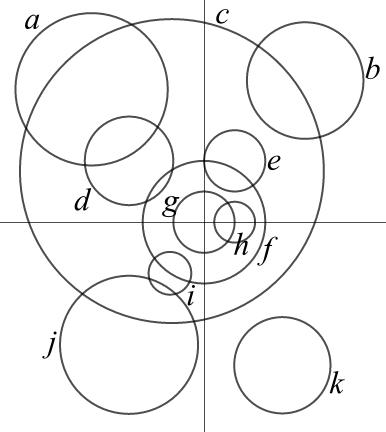

````
alias: Problem
layout: resource
clearance: 3
title: Matching circles and equations
keywords:
  - circle
  - equation
resourceType: RT7
stids1:
  - G2
  - E2
stids2:
pvids1:
  - PI1
pvids2:
priors:
  - G2_RT3

````



We have thought of 13 circles. Some of them are represented in the above diagram, with the labels of the $x$-axis and $y$-axis removed.  Here are equations for some of the circles.

1. $\left(x+10\right)^2 +\left(y+15\right)^2 = 4\pi ^2$
2. $x^2 + y^2 = 324$
3. $\left(x+22\right)^2 + \left(y+36\right)^2 = 411$
4. $\left(x+3\pi \right)^2 + \left(y-15\right)^2 = 1990$
5. $\left(x-21\sqrt{2}\right)^2 + \left(y-24 \sqrt{3} \right)^2 = 131\sqrt{5}$
6. $\left(x+33\right)^2 + \left(y-39\right)^2 = 500$
7. $x^2 + y^2 = 9$
8. $\left(x-23\right)^2 +\left(y+42\right)^2 = 200$
9. $x^2 + y^2 = 81$
10. $\left(x-18\right)^2 + \left(y+36\right)^2 = 1990$
11. $\left(x-9\right)^2 + y^2 = 36$

Can you match them up, find the missing equations and construct the remaining circles on the diagram?
