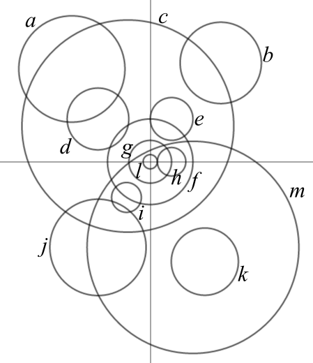

````
alias: Solution
````

Here's a summary of the matching between equations and circles.

-----------------------------------
Circle  Equation
------- ---------------------------
$a$     6

$b$     5

$c$     4

$d$     $(x+22)^2 + (y-18)^2 = 169$

$e$     $(x-9)^2 + (y-18)^2 = 81$

$f$     2

$g$     9

$h$     11

$i$     1

$j$     3

$k$     8

$l$     7

$m$     10
-----------------------------------

Here's a description of one way in which we could have found that matching.

Equation 11 describes a circle with centre on the $x$-axis, and we might notice that circle $h$ is such a circle. So we hope that these two match up. (In fact, one can show that we would end up with more than 13 circles if equation 11 and circle $h$ didn't match up.)

As circle $g$ passes through the centre of circle $h$, equation 9 belongs to circle $g$. 

Moreover, circle $f$ corresponds to equation 2 and we can draw the circle corresponding to equation 7. It is circle $l$ in the diagram below.

From the information we worked out so far, we deduce that circle $e$ has centre $(9,18)$ and radius $9$. So its equation is $(x-9)^2 + (y-18)^2 = 81$ (which isn't on the given list of equations).

By further considering the centres of the circles described by the remaining equations (e.g. by looking at which quadrant they lie in), we can match up circle $a$ and equation 6, circle $b$ and equation 5, circle $c$ and equation 4, circle $i$ and equation 1, circle $j$ and equation 3, and circle $k$ and equation 8.

To find the equation of circle $d$, we first work out its centre $(-22,18)$, e.g. by considering the centres of circles $e$ and $j$. Moreover, to obtain its radius we note that the point on circle $d$ which has the largest $x$-value and the point on circle $g$ which has the smallest $x$-value form a straight line parallel to the $y$-axis. Thus, the radius is $13$ and the equation of circle $d$ is $(x+22)^2 + (y-18)^2 = 169$.

Finally, to plot the circle with equation 10, we first construct its centre by using circle $j$ and circle $f$. Then, we could use the bisector method to find the centre of circle $c$ and take its radius to construct circle $m$.


