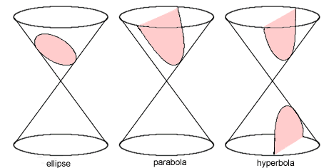
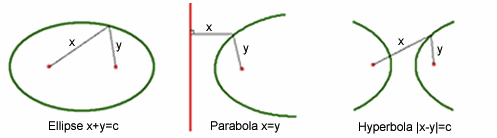

````
layout: resource
clearance: 0
title: Conic sections in real life
keywords:
  - conic section
  - ellipse
  - hyperbola
  - circle
  - parabola
  - cone
  - GPS
resourceType: RT15
stids1:
  - G4a
stids2:
pvids1:
pvids2:

````

Euclid and Archimedes are just two of the Greek mathematicians to have studied _conic sections_---the shapes created by slicing through a double cone with a flat plane. If the plane is perpendicular to the axis of the double cone, the intersection is a circle, and if the plane is angled parallel to the side of the cone the intersection is a parabola. If the plane cuts through both cones the intersection is a hyperbola. The only remaining case gives an ellipse.



_Image from NRICH.  Need permission or need to replace picture._


As well as having a description in terms of slicing through a cone, these shapes also have a description in terms of _loci_ (locations) of points: a circle is the locus of points the same distance from the centre (the focus of the circle); an ellipse is the locus of points whose distance from two foci sums to a constant $c$ ($x+y = c$ in the image below); a hyperbola is the locus of points with the same difference $c$ of distances from two foci ($|x-y| = c$); and a parabola is the locus of points equidistant from a focus and a straight line called the directrix ($x=y$).



_Image from NRICH.  Need permission or need to replace image._

Skip forward a couple of millennia and the mathematical properties of the conic sections have a very modern application. Suppose that you are lost in the jungle, but that luckily you are equipped with a device that can transmit and receive information, a clock, and a map. Your device picks up a signal from my device, which tells you my exact location and the exact time I sent my signal. 


<:= style(well) :>
Assuming you know how fast the signal travels, how can you use the information you have to determine how far away you are from me? 

<:= toggle(1, "Answer") :>

<:= collapsed(1) :>
If the signal travels at $c$ metres per second and takes $s$ seconds to reach you, then you are $c \times s$ metres away from me.
<:= collapsed() :>

<:= style() :>


<:= style(well) :>
Suppose you have worked out you are at distance $d$ from me. Which conic section describes all your possible locations?

<:= toggle(2, "Answer") :>

<:= collapsed(2) :>
A circle with radius $d$ centred on me.
<:= collapsed() :>
<:= style() :>


<:= style(well) :>

Suppose you have picked up two signals, one from me and one from another friend, Anna, telling you where on your map each of us is and at what time we sent the signal. How does that narrow down your possible locations?

<:= toggle(3, "Answer") :>
<:= collapsed(3) :>
You can use the time taken for both signals to reach you to calculate your distance $d$ from me and $m$ from Anna. Then you know you are located on the circumference of two circles, one centred on me and one on Anna, with respective radii $d$ and $m$. Distinct circles intersect in at most two points, so you are at either of those. If the circles don't intersect but only touch each other at one point then you know unambiguously where you are.

<:= collapsed() :>
<:= style() :>

<:= style(well) :>
GPS devices, like those in smart phones, use information sent out by GPS satellites (of which there are about 9 overhead at any one time) in a similar way.  Since the satellites are moving around in space, and therefore can't be located on a two-dimensional map of the Earth, we now need to consider three-dimensional geometry. Can you work out how many satellites are needed to pin-point the location of a smart phone?"

<:= toggle(4, "Answer") :>
<:= collapsed(4) :>
If you know your distance $d$ from one satellite you know that you are located on a sphere of radius $d$ centred at that satellite. The sphere meets the surface of the Earth in a circle, hence one satellite gives a circle as the set of possible locations. As circles can intersect in at most two points, we will need at most three satellites to work out your exact location.
<:= collapsed() :>
<:= style() :>

This method for finding a target’s location is called _trilateration_. Now let’s explore another method, _multireceiver radar_, which uses another conic section but requires fewer transmissions. 

Suppose again that you are lost in the jungle but that this time you have no map. My friend Anna and I need to pin-point your location to come and rescue you. I send you a signal, you immediately reply and Anna picks up the reply. Anna and I can communicate to establish the time that passed between me sending the signal and Anna receiving your reply.
  

<:= style(well) :>
What distance can Anna and I work out using that information?

<:= toggle(5, "Answer") :>
<:= collapsed(5) :>
Writing $x$ for the distance between me and you and $y$ for the distance between you and Anna, we can work out $x+y$ by multiplying the total time elapsed between me sending the signal and Anna receiving your reply by the signal's speed.
<:= collapsed() :>
<:= style() :>

<:= style(well) :>
Which conic section describes all your possible locations?

<:= toggle(6, "Answer") :>
<:= collapsed(6) :>
An ellipse with foci at my and Anna's locations.
<:= collapsed() :>
<:= style() :>

<:= style(well) :>
How many more people are needed to pin-point your exact location? How many transmissions are needed?

<:= toggle(7, "Answer") :>
<:= collapsed(7) :>
As with circles, ellipses generally meet in two points. So we would need two more ellipses, that is, two more people. Only two transmissions are needed, mine and yours.
<:= collapsed() :>
<:= style() :>

One downside of this method is that it assumes the target will immediately reply to any signal we send. What if we can't guarantee they will respond? Perhaps they don’t want to be found? Another conic section provides the answer.

Suppose now that you are hiding out in the jungle and that you are transmitting signals to your conspirators elsewhere. So as to not give away your location too easily your signals do not include information as to when they were sent. Anna and I can both pick up a signal sent by you and communicate to each other the time at which we received it. This means that we can work out the difference between the time it took the signal to reach me and the time it took to reach Anna.


<:= style(well) :>
What distance can Anna and I work out using that information?

<:= toggle(8, "Answer") :>
<:= collapsed(8) :>
Writing $x$ for the distance between me and you and $y$ for the distance between you and Anna, we can work out $|x-y|$ by multiplying the difference between the time it took the signal to reach me and the time it took to reach Anna by the speed of the signal.
<:= collapsed() :>
<:= style() :>

<:= style(well) :>
Which conic section describes all your possible locations?

<:= toggle(9, "Answer") :>
<:= collapsed(9) :>
A hyperbola with foci at my and Anna's locations.
<:= collapsed() :>
<:= style() :>

<:= style(well) :>
How many more people would Anna and I need to pin-point your exact location?

<:= toggle(10, "Answer") :>
<:= collapsed(10) :>
As for circles and ellipses, hyperbolae generally meet in two points. So we would need two more hyperbolae, that is, two more people.
<:= collapsed() :>
<:= style() :>

This covert technique, called _multilateration_, was used in WWI to locate enemy artillery ranges by listening to the [sound of their gunfire](http://en.wikipedia.org/wiki/Sound_ranging). Mathematical ideas that are over 2,000 years old are used to find lost souls and uncover hidden enemies!

***

#### Further Reading

This material is based on content first published on _[Plus](http://plus.maths.org)_, the free online maths magazine:

* [Conic sections hide and seek](http://plus.maths.org/content/conic-section-hide-seek)
* [Teacher Package - On Thin Ice: Maths and Climate Change in the Arctic](http://plus.maths.org/content/teacher-package-thin-ice-mdash-maths-and-climate-change-arctic)
