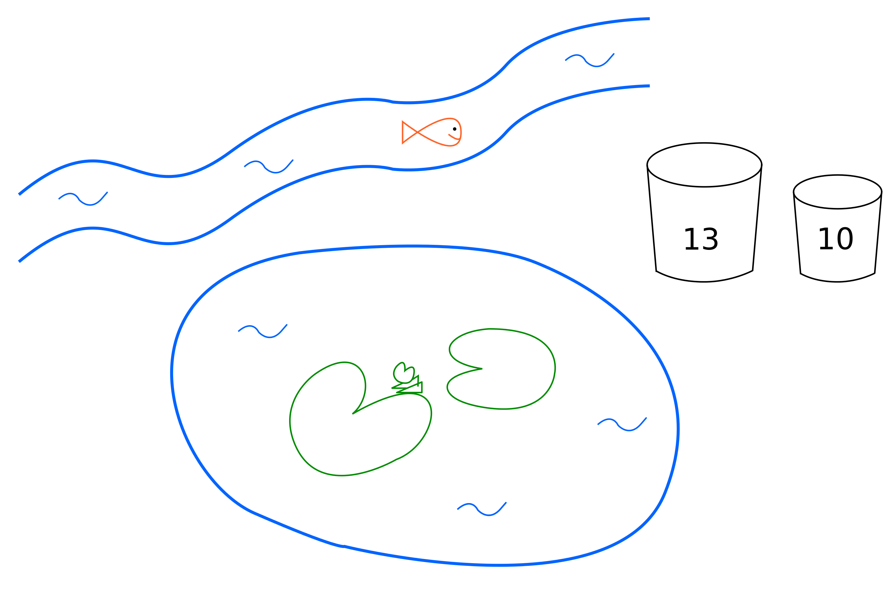

````
layout: resource
clearance: 0
title: Buckets and ponds
keywords:
  - Diophantine equation
  - linear equation
resourceType: RT9
stids1:
  - NA3*
stids2:
pvids1:
pvids2:
  - PI3
  - PI4

````



Here is a pond, near to a river.  We need to move 41 litres of water from the river to the pond.  To help with this, we have two buckets, one with capacity 10 litres and one that holds 13 litres.  The buckets are not calibrated, so we cannot measure part-buckets.  We can move water from the river to the pond, and from the pond to the river, but we must use the buckets.

Is it possible to move 41 litres from the river to the pond using these buckets?  How can we be sure?

There are now many questions that we as mathematicians might ask ourselves.  Here are a couple to get you started.

1.  Which amounts of water is it possible to move from the river to the pond?  Are there any amounts of water that we cannot move?  How can we be sure?

1.  What happens if we change the capacities of the buckets?  You might want to make some conjectures.  You might be able to prove or disprove your conjectures.

You could also explore your own questions.