````
layout: resource
clearance: 1
title: Symmetry
keywords:
  - symmetry
resourceType: RT15
stids1: 
stids2:
pvids1:
  - PI7
pvids2:
  - PI10

````

## Symmetry

Looking at the images below you’ll spot immediately which one is symmetric and which one is not. Symmetry is something we all understand instinctively; it seems to be hardwired into our brains. As mathematical concepts go, symmetry is perhaps the one that people find easiest to understand.

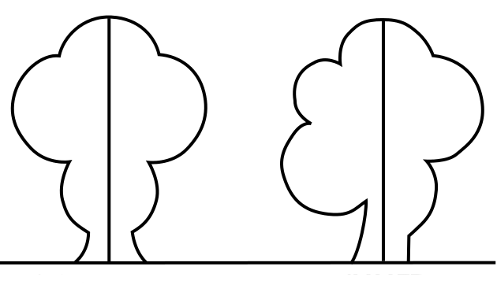


But what exactly is symmetry? If you haven’t thought about this before, the answer may not be that obvious: symmetry is immunity to change. The picture of the butterfly shown below is symmetric because you can reflect it in the vertical  line running down the centre and the resulting image is the same as the one you started with.

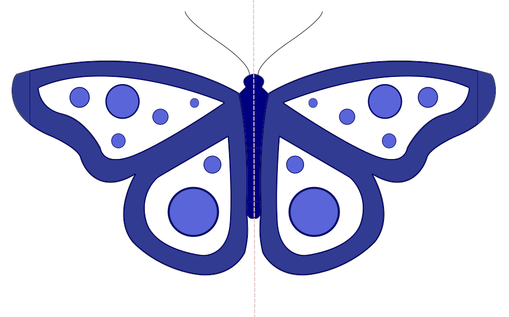

The picture of the snowflake also has mirror symmetry (there are lots of axes you can reflect it in), but in addition it is symmetric under rotation: spin it around the central point through a sixth of a full turn (that’s 60 degrees) and what you see is the same as the original image.

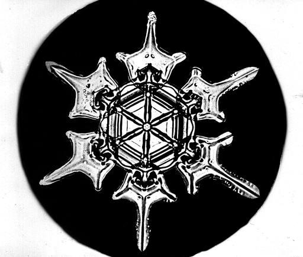

The picture of the bathroom tiling is symmetric because if you pick it up, shift it along by one square horizontally, vertically, or diagonally, and then put it down again you end up with the same pattern you started with---at least if you imagine the tiling to extend infinitely in both directions. 

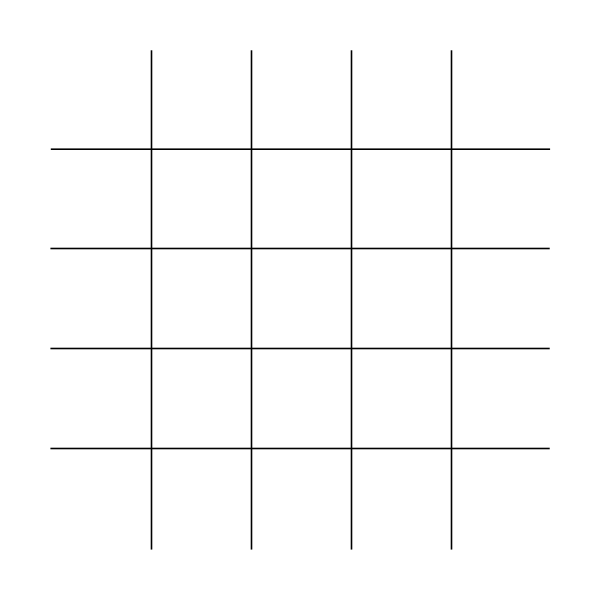

So a shape is symmetric if it remains the same when we apply a certain operation to it. In the case of shapes drawn on the two-dimensional plane the operations we are interested in are those that move a shape without changing distances between points. We have already met three types of such rigid motions: reflections, rotations and translations (moving an object along in a certain direction and by a certain distance). And this is almost all there is. In two dimensions the only remaining one describes the symmetry of a line of footprints in the sand. In this case the picture remains the same when you translate it by a certain amount and then reflect it in the line running horizontally between your foot prints. This type of rigid motion is called a glide reflection. 

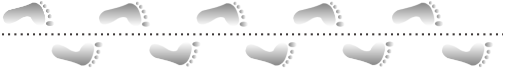

We usually think of symmetry as something we can see; something associated with patterns and shapes. But the more general concept of symmetry---immunity to change---means that all sorts of other objects can be symmetric too, including mathematical expressions. Think for example of the expression $7x^6-10x^4+4x^2-1$. It’s complicated, but because all the powers involved are even, its value is the same for both $x$ and $-x$. The expression is symmetric with respect to the transformation $x \rightarrow -x$. Being able to spot this is extremely useful. For example, we often want to find the values of $x$ for which an expression is equal to zero.  The symmetry means that once you have found such a value, its negative also gives you an answer to your problem. The symmetry also means that when sketching the graph of the function $f(x)=7x^6-10x^4+4x^2-1$  you only need to work out its shape for non-negative values of  $x$ and the rest follows. The graph, which is again a visual object,  is symmetric under reflection in the $y$-axis.

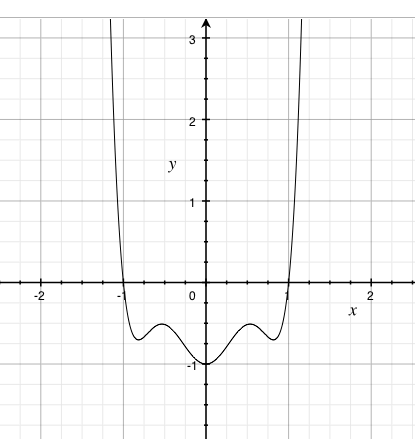

Problems too can contain symmetries. For example, suppose you are given a 3x3 grid and you are asked to put the numbers 0 and 1 into the cells so that no two rows are the same and no two columns are the same. There is an inherent symmetry here: once you have found a solution, swapping the 0s and 1s is also a solution.

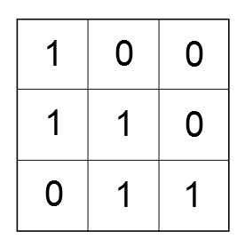

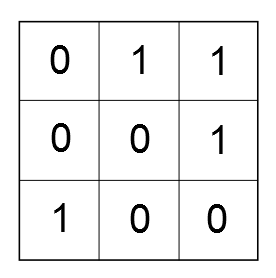

This symmetry makes your task of finding solutions easier. Once you have found one, you immediately get a second by interchanging 0s and 1s. And if a partially filled grid leaves you stuck because it cannot possibly be completed without breaking the rules, then you immediately know that the symmetric partial grid is not worth considering either:

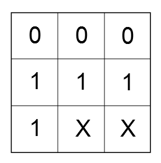

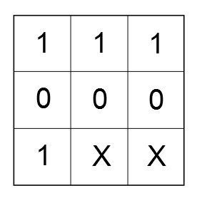

Many problems that occur in real life are about filling grids subject to particular constraints, for example creating timetables for schools or planning fixtures for a football league. These problems can be extremely tricky and are usually solved using computer programs that essentially try out all possible ways of filling the grid. Programs that exploit the inherent symmetries can run substantially faster than those that don’t.

In physics, symmetry has come to play an even more fundamental role. The laws of nature, such as those describing how gravity works, are symmetric under translations in space. Whether you drop an apple here, in Hawaii, or 2000 light years away, the same laws can be used to describe what will happen to it. Similarly, the laws of nature are symmetric under rotations. You are free to redefine North to be in the direction of the Eiffel tower rather than the North pole -- any experiments you perform will still have the same outcome. These symmetries are extremely useful: if the laws of nature changed depending on where you are or where you are looking, then there would be no hope of ever understanding them.

In the early part of the twentieth century, Albert Einstein decided that symmetry was such an important feature of nature that it should be put first. His theory of relativity resulted from the idea that the laws of nature should look _exactly the same to all observers_, no matter if they are riding an elephant or accelerating away from Earth in a spaceship.  Ever since then symmetry considerations have played a major role in physics. For example they have enabled physicists to predict particles that had never been observed, but were later found to exist in experiments. In physics, symmetry has become a guiding principle. As the Nobel Prize winner PW Anderson put it, "it is only slightly overstating the case to say that physics is the study of symmetry".

Studying symmetry is an important part of mathematics, not only because it is useful but also because it is a beautiful subject in its own right. One thing you will notice when you are playing with, say, the symmetries of a rectangle, is that when you follow one symmetry by  another the result is also a symmetry: the rectangle will look the same as when you started.  For example, first reflecting in the horizontal axis and then in the vertical axis has the same end result as a rotation through 180 degrees. 


You can represent all the different symmetries in a rectangle in a table which tells you how they combine. Writing $a$ for the reflection in the horizontal axis, $b$ for the reflection in the vertical axis, $c$ for the rotation through 180 degrees, and e for doing nothing at all, we get 

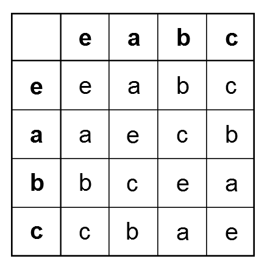

Here an entry in a given row and column tells you what you get when you do the symmetry corresponding to the row followed by the symmetry corresponding to the column.
The surprising thing is that a completely different situation can give you the same table. Take, for example, a line of four identical dots. Suppose you interchange dots 1 and 2 and dots 3 and 4. 

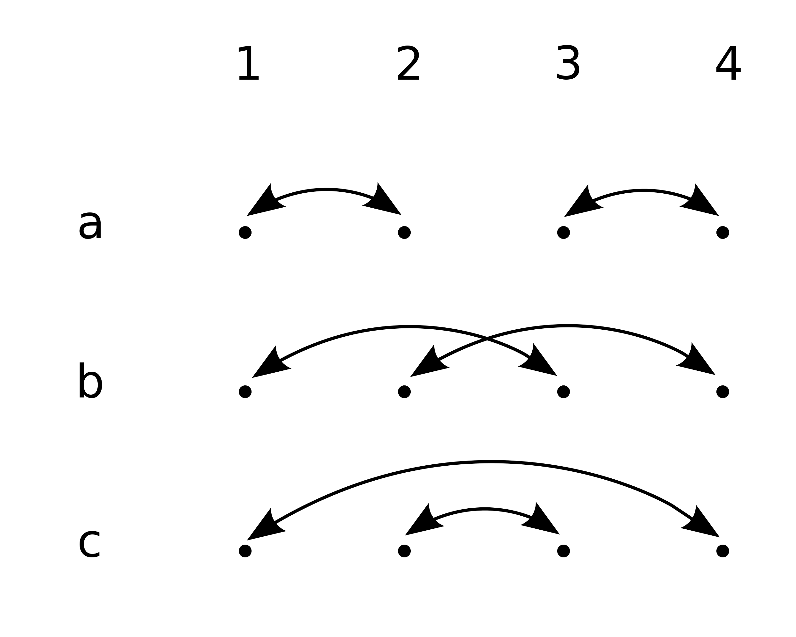

The picture will look the same, so this is a symmetry, for which we will write $a$. Interchanging dots 1 and 3 and dots 2 and 4 is also a symmetry, for which we will write $b$. The remaining possibility is to interchange 1 and 4 and 2 and 3, which we will denote by $c$. Writing down the table, again using the letter e for doing nothing, we see that these symmetries combine in exactly the same way as the symmetries of a rectangle!


This example illustrates that symmetries can be treated in an abstract way: rather than studying the actual objects, patterns or problems that exhibit symmetries, mathematicians study tables such as the one above, made up of a collection of _elements_ that combine in ways that follow certain rules. Such collections are called _groups_. Group theory is a major part of mathematics which, unsurprisingly, finds applications in all sorts of areas, from fundamental physics to solving tricky real life problems.
