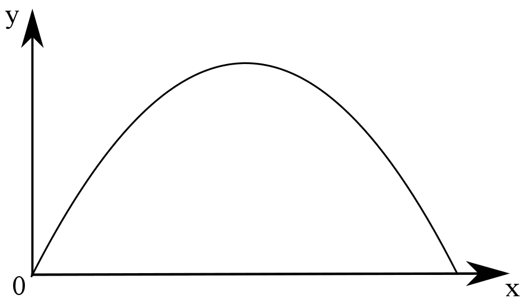
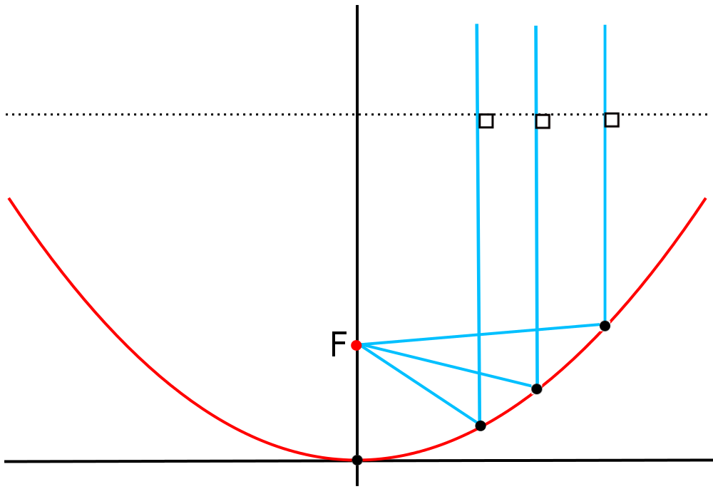

````
layout: resource
clearance: 0
title: Stopping safely
keywords:
  - quadratic
  - parabola
resourceType: RT15
stids1:
stids2:
pvids1:
pvids2:

````

Quadratic equations lie at the heart of many classical dynamics problems.  The most basic equation of motion states that speed is equal to distance travelled divided by time.  So if you travel $s$ metres in $t$ seconds then your average speed is  
$$v=\frac{s}{t}.$$

If you are moving at a constant speed with no forces acting upon you, this equation is all you need.  But what if some external force is acting, such as gravity on a falling body, or friction from the brake pads of a car on the spinning wheels?  

We know from Newton’s famous laws of motion that a constant force will cause an object to accelerate:  
$$F=ma,$$   
where $F$ is the force, $m$ is the object’s mass and $a$ is the acceleration.  So if you are moving at a speed $u$ and a force acts on you in the direction of your motion, then after $t$ seconds your speed is  
$$v=u+at. \qquad(1)$$  

When you are accelerating, your speed is changing with time.  Our original equation for speed, $v = \frac{s}{t}$, would now only give us the average speed we have travelled.  To get our instantaneous speed we need to think of speed as the rate of change of distance with time ($v=\frac{ds}{dt}$). With this new definition of speed we can integrate equation $(1)$ (with respect to time) to get the distance you have travelled in $t$ seconds:  
$$s=ut+\frac{1}{2}at^2. \qquad(2)$$

Here we have the quadratic equation that underlies acceleration, first written down by Galileo in the $17^{\mathrm{th}}$ century.  But this is not old mathematics, it has been used continually over the last four hundred years to understand how things move in the world around us.

A very modern example is calculating the stopping distances of cars.  When you apply the brakes on your car it translates into a braking force, roughly equivalent to a constant (around $a=4 \mathrm{ms}^{-2}$ in many cars).  How long will it take you to stop?

If you are travelling at speed $u$, the question is how long will it take you to decelerate to $v=0 \mathrm{ms}^{-1}$, a full stop?  From our equation $(1)$ above:  
$$0=u-at.$$  

(We have reversed the sign in front of $a$ since the car is decelerating.)  And so the time to stop is  
$$t=-\frac{u}{a}.$$  

We can substitute this expression for $t$ into our quadratic equation $(2)$ to give the stopping distance for a braking car:  
$$s=-\frac{u^2}{a}+\frac{1}{2}\left( \frac{u}{a}\right)^2 = -\frac{u^2}{2a}.$$  

This is another quadratic equation, this time for the stopping distance in terms of speed.  And this quadratic equation is very revealing: your stopping distance increases with the square of your speed---double your speed and you quadruple your stopping distance.  From this quadratic equation it is easier to understand why speed limits are set lower in built-up areas.  This is also the same quadratic equation that (together with some extra information about the road surface and car) allows road crash investigators to estimate the speed of vehicles from the length of their skid marks.

###Accurate aim

So far we’ve seen how a quadratic equation describes how things accelerate in the presence of a constant force.  But in our example above we looked at the simplified case when the force was acting in the direction of motion.  What happens more generally?

There is more to motion than just speed; there is also the direction in which you are moving.  These two pieces of information are combined into velocity, a vector which has both a magnitude, representing the speed, and a direction.

Suppose you throw a ball to your friend in the park.  When the ball leaves your hand its velocity can be thought of as a combination of horizontal speed, $u$, (which we’ll think of as movement in the $x$ direction), and vertical speed, $v$, (movement in the $y$ direction).  Then, ignoring wind resistance, the ball’s horizontal speed will remain constant and the horizontal distance the ball travels in $t$ seconds is:  
$$x=ut.$$  

But in the vertical direction the ball feels the force of gravity as an acceleration of $g\approx9.8 \mathrm{ms}^{-2}$ downward.  So we can again use equation $(2)$ to give the vertical position of the ball after $t$ seconds as:  
$$y=vt-\frac{1}{2}gt^2.$$  

We can rearrange these to give:  
$$y=\left(\frac{v}{u}\right)x-\frac{1}{2u^2}gx^2.$$  

This quadratic equation describes the motion of any object that is affected by a constant force.  Plotting this reveals the beautiful parabolic shape of any such trajectory.



We see parabolas, the physical representation of quadratic equations, around us every day: say when you throw a ball in the park, or in the fall of a water fountain.  But these quadratic equations have more deadly uses: they have been the basis for artillery calculations for centuries.

###Power of parabolas

Parabolas have been fascinating mathematicians for millennia since they were first discovered by the Greeks around 300BC.  Parabolas are one of the types of curves that result from slicing through a double cone, called the conic sections (you can read more about conic sections [here](../G4a_RT15/index.html)).  The other conic sections are circles, ellipses and hyperbolas. You can draw these using their geometric definitions in terms of the distance of these curves to their foci.  

To draw a circle you have a loop of string between the centre of the circle and your pencil, moving your pencil around keeping the string taut.  An ellipse can be drawn in a similar way, except this time the loop of string goes around the two foci and your pencil.  The same method works theoretically for the parabola, only this time your loop of string has to go around the two foci of the parabola and your pencil, the only problem being that the second focus of the parabola is infinitely far from the first!  As not many people have an infinitely long piece of string handy, we can instead think of the loop from infinity coming in as a straight line parallel to the axis of symmetry.  



This focussing property of the parabola has some very useful consequences.  Any line entering the parabola, parallel to the axis of symmetry, will be reflected off the parabola to the focus.  This is the reason satellite dishes are parabolic in shape---any signals effectively come from infinity, so they hit the dish parallel to its axis and are reflected to the satellite receiver placed at the focus of the parabola.

The same principle works in the reverse way.  Any lines from the focus of a parabola will be reflected off the curve as a line parallel to the axis.  Car headlights use this property by placing the bulb at the focus of a parabolic mirror, the mirror reflecting all the light rays from the bulb directly forward in front of the headlight parallel to the parabola’s axis.

This power of parabolas has been used for centuries.  Lighthouses traditionally used parabolic mirrors to turn the light from a lantern into a beam.  And even as far back as the $3^{\mathrm{rd}}$ century BC, the mathematician Archimedes designed a weapon that reflected the light from the sun off a parabolic arrangement of mirrors to focus the heat onto an enemy’s ship.

It is clear that quadratic equations and their parabolic shape are very powerful.  With great power comes great responsibility... use them wisely!
